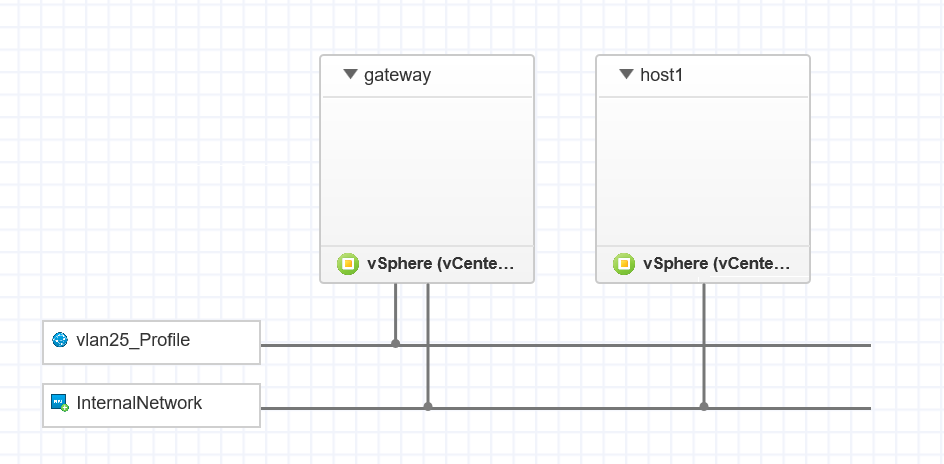
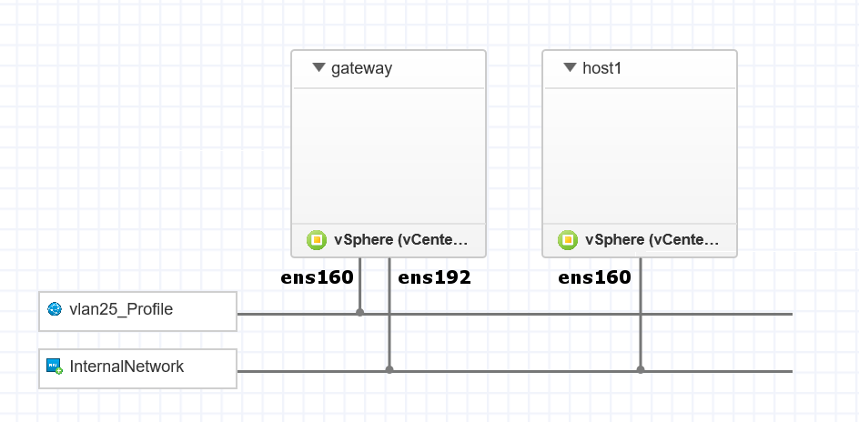
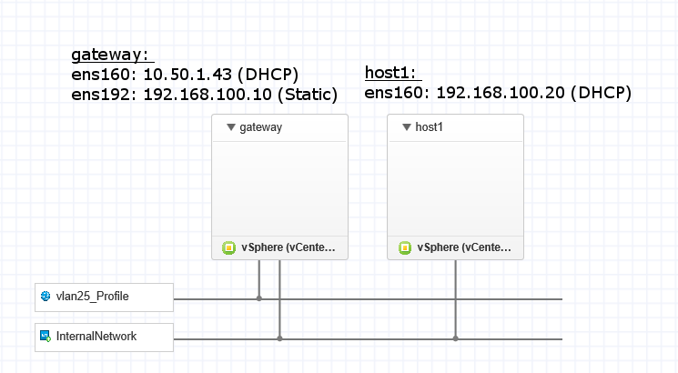

This post documents how to build a Linux gateway using Ubuntu Server 18.04. The gateway connects an internal network to an external network - basically, performing Network Address Translation (NAT) for hosts on the internal network. It is exceptionally similar to what your ISP supplied home router does. To achieve this, an Ubuntu Linux server is configured as a DHCP server and also to provide NAT using `iptables`. 

## Contents

```toc
```

## Introduction

This tutorial is written when building a blueprint for VMWare vRealize, but the instructions lend to any virtualization, or normal, system. The _gateway_ connects to an external network named _vlan25_Profile_ which provides Internet access, and a second network, _InternalNetwork_, which is an isolated network. While _host1_ only connects to the _InternalNetwork_. The vRealize blueprint for the network is displayed below.



## Configure Network Interface Cards

The server only has one primary requirement: two Network Interface Cards (NICs). Start by listing the NICs that are available on the system:

```none
ls /sys/class/net/
```

If one, or no, NICs are present more need to be added in the hardware configuration for the virtual machine. In the case of a normal machine, one or two physical NICs are required. Another example of the network architecture is displayed below. This time, the NIC interface names have been supplied:



Now we know the names of the two NICs, we can edit the networking configuration file. Open the interfaces file using the `vim` editor, or another text editor of your choice (e.g., `nano`):

```none
sudo vim /etc/network/interfaces
```

In the following instructions, the two NICs that will be configured are `ens160` and `ens192`. The `ens160` NIC is connected to the outside world and will receive an IP address configuration from an external DHCP server. The `ens192` NIC is the internal interface that is connected to the same network that the internal hosts are on. Given the preceding network setup, the following configuration is specified:

```none
auto ens160
iface ens160 inet dhcp

auto ens192
iface ens192 inet static
    address 192.168.100.10
    netmask 255.255.255.0
    gateway 192.168.100.1
```

Restart networking on the system so that the new configuration is applied:

```none
sudo systemctl restart networking
```

## Install DHCP server

We are going to use Dynamic Host Configuration Protocol (DHCP) to supply IP addresses to any host on the internal network. Install the default package supplied by the Ubuntu repositories:

```none
sudo apt install isc-dhcp-server
```

Edit the server configuration file:

```none
sudo vim /etc/default/isc-dhcp-server
```

The only change required here is to put the internal (`ens192`) interface in the file:

```none
INTERFACES="ens192"
```

Now, edit the DHCP configuration:

```none
sudo vim /etc/dhcp/dhcpd.conf
```

Add the following configuration for the DHCP server. 

```none
option domain-name-servers 8.8.8.8, 8.8.8.4;

option subnet-mask 255.255.255.0;
option broadcast-address 192.168.100.255;
subnet 192.168.100.0 netmask 255.255.255.0 {
range 192.168.100.20 192.168.100.100;
option routers 192.168.100.10;
}
```

A good resource for DHCP options is the [dhcp-options man page from die.net](https://linux.die.net/man/5/dhcp-options). The first line of the configuration above specifies DNS settings. This allows translation of computer-friendly IP addresses to human-friendly domain names; for example: `google.com` corresponds to `172.217.25.142`. If you want, you can specify a `domain-name` option as well, but this is not required. However, make sure to include the `domain-name-servers` option with valid IP addresses from DNS servers. You can use the free Google DNS server using the value `8.8.8.8` or `8.8.8.4`, or use any other DNS server that you wish.

The remaining options specified above are for IP address allocation. This configuration is for the IP range `192.168.100.0\24`, or from `192.168.100.0` to `192.168.100.254`. The `range` option specifies the range of addresses to provide for lease, in this case, it is limited to 80 addresses, from `192.168.100.20` to `192.168.100.100`. This can be modified to suit. Finally, the `routers` option, specifies the address of the _gateway_ machine, which has a static IP address of `192.168.100.10`. The `routers` option has the IP address of the _gateway_ because this is the machine that forwards traffic from the internal network to external networks.

Save the file, then restart service:

```none
sudo service isc-dhcp-server restart
```

## Configure Network Address Translation

Enable IPv4 forwarding:

```none
sudo vim /etc/sysctl.conf
```

Uncomment the following line:

```none
net.ipv4.ip_forward=1
```

Check forwarding worked using:

```none
sysctl net.ipv4.ip_forward
OR
cat /proc/sys/net/ipv4/ip_forward
```

Add a NAT forwarding rule using `iptables`:

```none
sudo iptables -t nat -A POSTROUTING -o ens160 -j MASQUERADE
```

Save the `iptables` configuration:

```none
sudo apt install iptables-persistent
sudo su
sudo iptables-save > /etc/iptables/rules.v4
exit
```

Ensure the rules load at boot:

```none
vim /etc/rc.local 
```

Add the following line:

```none
/sbin/iptables-restore < /etc/iptables/rules.v4
```

## Configuring Internal Hosts: Linux

With the gateway setup to provide DHCP and NAT services, a Linux host on the internal network can be configured to acquire an IP address from the gateway, and have all traffic routed through the gateway. The only configuration required on a Linux client is to edit the network configuration file and set the NIC of the client to DHCP.

List the NICs that are available on the system:

```none
ls /sys/class/net/
```

Open the network interfaces file:

```none
vim /etc/network/interfaces
```

In the following instructions, the NICs on the Linux client is named `ens160`. Configure the NIC to receive an IP address from the gateway:

```none
auto ens160
iface ens160 inet dhcp
```

Make sure to restart the networking service to make sure the new configuration is applied:

```none
sudo systemctl restart networking
```

## Configuring Internal Hosts: Windows

A full tutorial on configuring DHCP is beyond the scope of this post. Instead, I recommend checking out the [excellent tutorial provided by Microsoft](https://support.microsoft.com/en-nz/help/15089/windows-change-tcp-ip-settings) that covers how to configure a NIC for DHCP in Windows 10, 8.1, and 7. When configured you can open a Command Prompt and use the following command to check the configuration is working.

```none
ipconfig
```

## Check Network Connectivity

The overall network configuration is completed and hosts should be able to get IP addresses from the gateway DHCP server. Furthermore, the gateway will forward any traffic from the hosts to the outside world (Internet) and have DNS support. A summary of the IP addresses for each machine and NIC is displayed in the figure below:



You can check the DHCP leases on the _gateway_ machine using the following command:

```none
cat /var/lib/dhcp/dhcpd.leases
```

From _host1_, or any other hosts on the internal network, it would be useful to check the connectivity by first pinging the DHCP allocated address:

```none
ping 192.168.100.20
```

Then ping the IP address of the gateway internal-facing interface:

```none
ping 192.168.100.10
```

Then finish it off with pinging any Internet DNS name:

```none
ping google.com
```

If all these tests pass, the configuration was successful!
