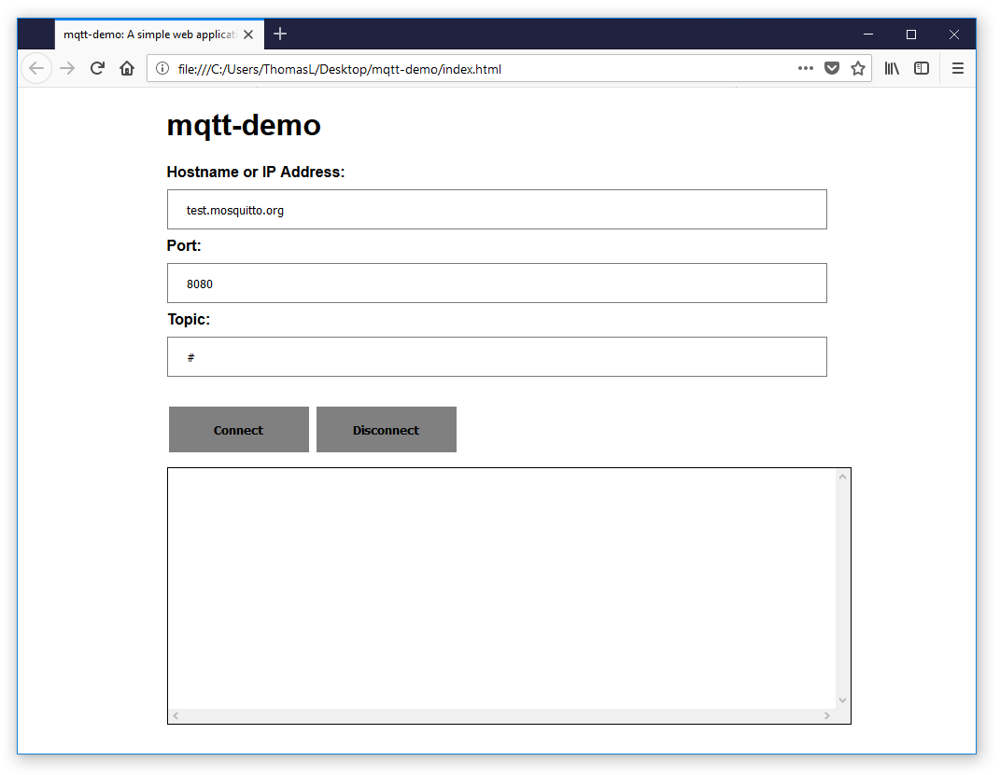
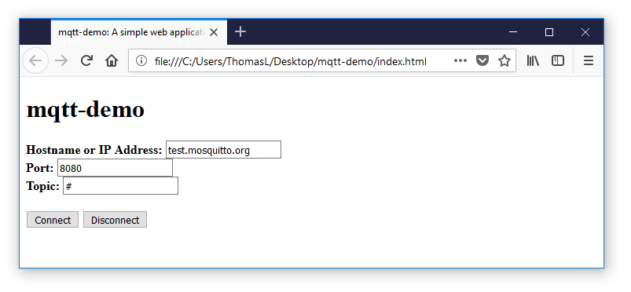
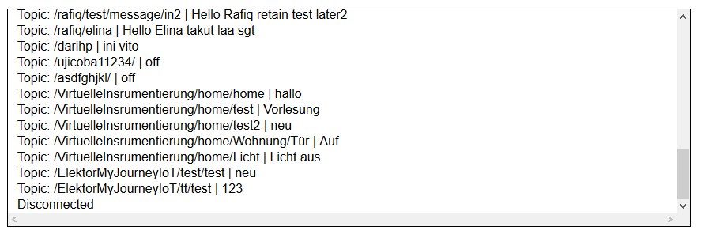

This post outlines a tutorial and explanation of how to use the Paho MQTT JavaScript library to build a basic web application to subscribe to MQTT messages from a broker. The resultant source code is available from the following repository: [js-mtt-websockets-demo](https://github.com/thomaslaurenson/MQTT-Subscription-Examples). Please feel free to use it as a base in your project. The final web application is simple, yet functional.



## Contents

```toc
```

## Introduction

MQTT is a machine-to-machine connectivity/communication protocol. So what does this mean? MQTT is used by machines (think computer programs) for the transfer of data (think messages). Although MQTT has several uses, it is exceptionally prominent in the _Internet of Things_. The technology suits IoT because it is exceptionally lightweight and provides the functionality to subscribe and publish messages. And, of course, it suits IoT because it is naturally a machine-to-machine network.

MQTT is used by [The Things Network](https://www.thethingsnetwork.org/docs/applications/mqtt/), who are building a global IoT network using LoRaWAN. In my job as a lecturer, I am supervising a group of students who are building an open LoRaWAN network in Dunedin City. In this project, we have implemented the open source [LoRa Server](https://www.loraserver.io/), which also uses MQTT to [publish and subscribe to IoT data](https://www.loraserver.io/lora-app-server/integrate/sending-receiving/mqtt/).

To first understand what MQTT is used for, it is prudent to understand a typical IoT/LoRaWAN network. There are several components in a network:

- A node device: a small embedded device with a sensor (e.g., temperature sensor) which sends data using a LoRaWAN wireless chip
- A gateway device: similar to a WiFi access point which forwards data from nodes to a specific destination, usually a server
- A network server: a computer that manages devices (gateways and nodes) and processes data sent from devices (nodes)
- An application: a solution the end-user has to display data

I like to be explained things in layman terms. When I first witnessed MQTT I didn't really understand how the technology worked, or how it was used. The technical jargon was intimidating! The important use of MQTT for clients is in the subscription of MQTT data from a server. For example, create a web application or mobile application that retrieves and displays node data. But how does it get the data? Answer: it subscribes to an MQTT topic that the server publishes. 

I like to explain the MQTT protocol similar to FM radio. A client is similar to the radio you have in your car. It can tune frequencies to listen to specific radio stations. The IoT equivalent is a subscription to an MQTT topic, where you must tune to the MQTT server. The key aspect, MQTT publications are live - the same way the radio station is live. If you want to save the music that a radio station is playing, you must record it. MQTT subscription is the same! 

This post covers how to write a simple MQTT subscription client for an IoT/LoRaWAN network. In this tutorial, the client will be a web application (usable on any modern web browser) that is written in HTML and JavaScript. The web application will subscribe to an MQTT topic from a server and print the information to the web page.

## The Eclipse Paho MQTT JavaScript Library

The first thing we need is an MQTT library to build our client. Writing an MQTT client is greatly simplified by using a well-documented and thoroughly tested library. I mean, why re-invent the wheel, when a group of talented developers have already designed an excellent wheel!

The [Eclipse Paho project](https://www.eclipse.org/paho/) is an excellent open source MQTT client that is available for a variety of programming languages, including JavaScript. The [Eclipse Paho Downloads](https://www.eclipse.org/paho/downloads.php) page provides a summary of the support for different programming languages and the functionality provided in each. The [Eclipse Paho JavaScript client GitHub](https://github.com/eclipse/paho.mqtt.javascript) page has some good documentation on getting started using the library. However, in this post, we will cover each step and explain it along the way.

## MQTT Over Websockets

In order to connect and subscribe to MQTT using JavaScript from within a web browser, MQTT must be configured to operate over web sockets. This is not implemented by default in most MQTT brokers; for example, Mosquitto does not enable web sockets by default. Make sure the MQTT broker you are attempting to connect to using this tutorial has web sockets enabled and that you have the correct web socket port.

## Building an MQTT Web Application

#### Create a folder structure

First, create a folder to house the web application. I have just created a folder on my desktop named: `mqtt-demo`. Inside that folder I have created a selection of files required for this project:

- `demo.html`: A HTML file containing the web page content and structure
- `demo.js`: A JavaScript source file where will put the MQTT subscription code
- `style.css`: A CSS style sheet to enhance the design on the web page

## Creating the HTML Page

#### HTML: Creating a simple skeleton

To start we should create a simple skeleton HTML document. The structure is very simple. The `<head>` element contains a title for the web page. The `<body>` element contains two `<div>` elements, one name _wrapper_ and one named _messages_. The wrapper contains all the content on the page, while the messages will display the MQTT messages received.

```html
<!DOCTYPE html>
<html>
   <head>
      <meta charset="utf-8">
      <title>mqtt-demo: A simple web application that can subscribe to topics from an MQTT broker over websockets</title>
   </head>
   <body>
      <div class="wrapper">
         <h1>mqtt-demo</h1>
         <h2>A simple web application that can subscribe to topics from an MQTT broker over websockets</h2>
         <div id="messages">
         </div>
      </div>
   </body>
</html>
```

#### HTML: Adding the required libraries and external files

In order to achieve a functioning web application, we must add a variety of libraries and external files to the HTML source code. Firstly, we should add the style sheet named `style.css`. Secondly, we must have the Paho JavaScript MQTT library, a `.js` file that will provide MQTT subscription functionality. This file is retrieved from [CDNJS](https://cdnjs.com/). Thirdly, we need to add the `demo.js` file that we just created. This file will host our code to connect to the MQTT broker. 

The final header should look like the code snippet below:

```html
<head>
  <meta charset="utf-8">
  <title>mqtt-demo: A simple web application that can subscribe to topics from an MQTT broker over websockets</title>
  <link rel="stylesheet" href="style.css">
  <script src="https://cdnjs.cloudflare.com/ajax/libs/paho-mqtt/1.0.2/mqttws31.min.js" type="text/javascript"></script>
  <script src="demo.js" type="text/javascript"></script>
</head>
```

#### HTML: Adding a simple HTML form to get MQTT broker information

Next, we will add a simple HTML form to allow input of essential MQTT configuration information. This form will have three boxes to enter in: 1) The hostname or IP address of the MQTT broker; 2) The port number for the MQTT broker; and 3) The topic to subscribe to. In addition, we are going to put in two buttons: 1) To connect to the server and subscribe to a topic; and 2) To disconnect from the server. 

Below is a simple form that will get the job done. Note how default values have been added with the `value="property"` syntax. This information will display by default in the form, but can just be overwritten by new content. The current default values are set to the Mosquitto MQTT test server, which is excellent to test if the MQTT subscription is working. Also, note how the default topic is set to a hashtag symbol (`#`) - this is a wildcard and will subscribe to any topic provided by the MQTT broker.

```html
<form id="connection-info-form">
  <b>Hostname or IP Address:</b> 
  <input id="host" type="text" name="host" value="test.mosquitto.org"><br>
  <b>Port:</b>
  <input id="port" type="text" name="port" value="8080"><br>
  <b>Topic:</b>
  <input id="topic" type="text" name="topic" value="#"><br><br>
  <input type="button" onclick="startConnect()" value="Connect">
  <input type="button" onclick="startDisconnect()" value="Disconnect">
</form>
```

The form is configured to send the MQTT configuration to the `demo.js` file (covered in detail below). Specifically, when the _Connect_ button is clicked it calls the `startConnect` function and when the _Disconnect_ button is clicked it called the `startDisconnect` function. We will use these function names later when writing the JavaScript code.

#### HTML: Adding a div for MQTT messages

We need one final addition to the HTML page: a location to write all MQTT messages received. It is a simple addition of a single `div` element under the form. Take note that the `id` for the `div` is named `messages`.

```html
<div id="messages"></div>
```
         
#### HTML: Final HTML page

The entire HTML page we have made so far is documented below:

```html
<!DOCTYPE html>
<html>
   <head>
      <meta charset="utf-8">
      <title>mqtt-demo: A simple web application that can subscribe to topics from an MQTT broker over websockets</title>
      <link rel="stylesheet" href="style.css">
      <script src="https://cdnjs.cloudflare.com/ajax/libs/paho-mqtt/1.0.2/mqttws31.min.js" type="text/javascript"></script>
      <script src="demo.js" type="text/javascript"></script>
   </head>
   <body>
      <div class="wrapper">
         <h1>mqtt-demo</h1>
         <form id="connection-information-form">
            <b>Hostname or IP Address:</b> 
            <input id="host" type="text" name="host" value="test.mosquitto.org"><br>
            <b>Port:</b>
            <input id="port" type="text" name="port" value="8080"><br>
            <b>Topic:</b>
            <input id="topic" type="text" name="topic" value="#"><br><br>
            <input type="button" onclick="startConnect()" value="Connect">
            <input type="button" onclick="startDisconnect()" value="Disconnect">
         </form>
         <div id="messages"></div>
      </div>
   </body>
</html>
```

Currently, our web application has no functionality! When you click either button it does nothing! And it is not exactly sleek! But we will fix both those issues in the next sections.



## Creating the JavaScript Code for MQTT

#### JS: Fetching the values from the form

The first step to connecting to an MQTT broker is to fetch the information supplied by the user in the HTML form. This is easy using the `document.getElementByID` method. Luckily, we have already set the unique ID value in the HTML form, these were: `host`, `port` and `topic`. We can use the simple JavaScript code below to save these values from the form into JavaScript variables with the same naming convention.

```js
host = document.getElementById("host").value;
port = document.getElementById("port").value;
topic = document.getElementById("topic").value;
```

#### JS: Writing the `startConnect` function

Now that we have the required variables we can begin writing the code for the MQTT subscription. The first thing we should do is generate a _client ID_ value. This can essentially be any string of characters and/or numbers but **it must be unique**. We can simply leverage the `Math.random` function to generate a random number and concatenate it to a string value of `"clientID_"`. This will result in something like: `clientID-62`.

```js
// Generate a random client ID
clientID = "clientID_" + parseInt(Math.random() * 100);
```

We now have all the information required to connect to the MQTT broker: 1) The hostname/IP address; 2) The port number; and 3) The random clientID string. We can call the `Paho.MQTT.Client` method using these three variables. To make sure we are passing an integer as the port number, simple intcast the variable `port` using `Number(port)`.

```js
// Initialize new Paho client connection
client = new Paho.MQTT.Client(host, Number(port), clientID);
```

After the connection to the MQTT broker has been specified and the `client` object created, we can set the callback handlers for the client. These functions will be called if something goes wrong; for example, if the connection to the MQTT broker is lost, or when an MQTT message has arrived. We will write these functions later.

```js
// Set callback handlers
client.onConnectionLost = onConnectionLost;
client.onMessageArrived = onMessageArrived;
```

Finally, we can specify the `client` to connect. In this piece of code, we have an `onSuccess` action. When the connection works, the `onConnect` function is called. This will be where we subscribe to a specific topic. 

```js
// Connect the client, if successful, call onConnect function
client.connect({ 
    onSuccess: onConnect,
    onFailure: document.getElementById("messages").innerHTML += '<span>ERROR: Connection to: ' + host + ' on port: ' + port + ' failed.</span><br/>';
});
```

One more thing, there is also an `onFailure` action in the `onConnect` function. When the connection fails, the _messages_ div in the webpage will display an error to the user. This is a simple, no jQuery solution. Basically, the `document.getElementById("messages")` will identify the _messages_ div, the `.innerHTML +=` will append text to the div, and `'<span>ERROR: Connection to: ' + host + ' on port: ' + port + ' failed.</span><br/>'` will print an error message which also documents the hostname/IP and port number.

It is very common for error messages like this to be handled and displayed using the JavaScript `console.log(message)` solution. However, this is only displayed in the web browser console, which some end-users have no knowledge of. So instead, we will display the error message on the actual web page itself.

The final, completed, `startConnect` function is displayed below. Not how we use the same `innerHTML +=` solution to display the connection information in the full example below. This, again, provides feedback to the end-user.

```js
// Called after form input is processed
function startConnect() {
    // Generate a random client ID
    clientID = "clientID_" + parseInt(Math.random() * 100);

    // Fetch the hostname/IP address and port number from the form
    host = document.getElementById("host").value;
    port = document.getElementById("port").value;

    // Print output for the user in the messages div
    document.getElementById("messages").innerHTML += '<span>Connecting to: ' + host + ' on port: ' + port + '</span><br/>';
    document.getElementById("messages").innerHTML += '<span>Using the following client value: ' + clientID + '</span><br/>';

    // Initialize new Paho client connection
    client = new Paho.MQTT.Client(host, Number(port), clientID);

    // Set callback handlers
    client.onConnectionLost = onConnectionLost;
    client.onMessageArrived = onMessageArrived;

    client.connect({ 
        onSuccess: onConnect,
        onFailure: document.getElementById("messages").innerHTML += '<span>ERROR: Connection to: ' + host + ' on port: ' + port + ' failed.</span><br/>';
    });
}
```

#### JS: Writing the `onConnectionLost` function

When writing the `startConnect` function, we specified two callback functions. The first was the `onConnectionLost` function. This code is specified so that in the event of a lost connection an event can be specified. Similar to the previous code, we are going to put in some code that will display an error message in the _messages_ div. In the scenario where the exit code from the connection is not `0`, we will also print the error the _messages_ div.

```js
// Called when the client loses its connection
function onConnectionLost(responseObject) {
    document.getElementById("messages").innerHTML += '<span>ERROR: Connection lost</span><br/>';
    if (responseObject.errorCode !== 0) {
        document.getElementById("messages").innerHTML += '<span>ERROR: ' + + responseObject.errorMessage + '</span><br/>';
    }
}
```


#### JS: Writing the `onMessageArrived` function

When writing the `startConnect` function, we specified two callback functions. The second was the `onMessageArrived` function. This code is very important! This function is called every time that a message is received from the MQTT broker. Similar to the previous code, we are going to put in some code that will display the message in the _messages_ div. 

```js
// Called when a message arrives
function onMessageArrived(message) {
    document.getElementById("messages").innerHTML += '<span>Topic: ' + message.destinationName + '  | ' + message.payloadString + '</span><br/>';
}
```

#### JS: Writing the `startDisconnect` function

This is the final JavaScript function we require. When we made our HTML form we specified a button that would disconnect from the MQTT subscription. We can simply call the `disconnect` method on the `client` and the MQTT connection will be closed. We will also print out a message in the _messages_ div to inform the user.

```js
// Called when the disconnection button is pressed
function startDisconnect() {
    client.disconnect();
    document.getElementById("messages").innerHTML += '<span>Disconnected</span><br/>';
    updateScroll(); // Scroll to bottom of window
}
```

#### JS: Final JavaScript code

The entire JavaScript code in the `demo.js` file we have made so far is documented below:

```js
// Called after form input is processed
function startConnect() {
    // Generate a random client ID
    clientID = "clientID-" + parseInt(Math.random() * 100);

    // Fetch the hostname/IP address and port number from the form
    host = document.getElementById("host").value;
    port = document.getElementById("port").value;

    // Print output for the user in the messages div
    document.getElementById("messages").innerHTML += '<span>Connecting to: ' + host + ' on port: ' + port + '</span><br/>';
    document.getElementById("messages").innerHTML += '<span>Using the following client value: ' + clientID + '</span><br/>';

    // Initialize new Paho client connection
    client = new Paho.MQTT.Client(host, Number(port), clientID);

    // Set callback handlers
    client.onConnectionLost = onConnectionLost;
    client.onMessageArrived = onMessageArrived;

    // Connect the client, if successful, call onConnect function
    client.connect({ 
        onSuccess: onConnect,
    });
}

// Called when the client connects
function onConnect() {
    // Fetch the MQTT topic from the form
    topic = document.getElementById("topic").value;

    // Print output for the user in the messages div
    document.getElementById("messages").innerHTML += '<span>Subscribing to: ' + topic + '</span><br/>';

    // Subscribe to the requested topic
    client.subscribe(topic);
}

// Called when the client loses its connection
function onConnectionLost(responseObject) {
    document.getElementById("messages").innerHTML += '<span>ERROR: Connection lost</span><br/>';
    if (responseObject.errorCode !== 0) {
        document.getElementById("messages").innerHTML += '<span>ERROR: ' + + responseObject.errorMessage + '</span><br/>';
    }
}

// Called when a message arrives
function onMessageArrived(message) {
    console.log("onMessageArrived: " + message.payloadString);
    document.getElementById("messages").innerHTML += '<span>Topic: ' + message.destinationName + '  | ' + message.payloadString + '</span><br/>';
}

// Called when the disconnection button is pressed
function startDisconnect() {
    client.disconnect();
    document.getElementById("messages").innerHTML += '<span>Disconnected</span><br/>';
}
```

We have finally got somewhere! With the addition of this JavaScript code we have a functioning web application that will connect to an MQTT broker, subscribe to an MQTT topic and print the received messages to the web page. An example of the web application receiving messages can be seen below:


## Styling the Web Application

#### CSS: Styling the HTML page

As it currently stands, our web application has a nice form and the required functionality to connect, subscribe and display MQTT messages to the end-user. However, we should probably add a little style to make the page look better and make the messages easier to view and review.

The following CSS rules can be placed in the `style.css` file. These are just simple CSS rules that will add a little style and can be modified based on your requirements. The following rules specify the Open Sans font and set a `wrapper` div for the page to ensure it is centered and has a suitable width.

```css
body {
    font-family: "Open Sans", sans-serif;
}
.wrapper {
    margin-left: auto;
    margin-right: auto;
    width: 70%;
    padding-right: 10px;
    padding-left: 10px;
}
```

#### CSS: Styling the HTML form

The HTML form has a terrible default layout without some CSS rules. Listed below are some basic rules to enhance the style of the form.

```css
input {
    width : 150px;
    margin: 0;
    -webkit-box-sizing: border-box;
    -moz-box-sizing: border-box;
    box-sizing: border-box;
}
input[type=text] {
    width: 100%;
    padding: 12px 20px;
    margin: 8px 0;
}
input[type=button] {
    background-color: gray;
    border: none;
    color: black;
    padding: 16px 32px;
    text-decoration: none;
    font-weight: bold;
    margin: 4px 2px;
    cursor: pointer;
}
input[type=text]:focus {
    background-color: lightblue;
}
input[type=button]:hover {
    background-color: #686868;
}
```

#### CSS: Styling the messages div

Finally, the most important part of the web page style is the _messages_ div. Without modification, it will print continuously to the bottom of the webpage and is difficult and messy to deal with the MQTT messages. These simple CSS rules will create a fixed sized block to display the messages, complete with a vertical scrollbar. 

```css
#messages {
    margin-top: 12px;
    margin-bottom: 12px;
    padding: 12px;
    width:100%;
    display: inline-block;
    border:1px solid black;
    max-height: 250px;
    min-height: 250px;
    overflow: scroll;
}
#messages span {
    overflow-y: scroll;
    overflow: scroll;
}
```

#### JS: Writing the `updateScroll` function

In the last section, we styled the _messages_ div and made it scrollable. One more nice feature would be if the messages box scrolled when it is full. 

```js
// Updates #messages div to auto-scroll
function updateScroll() {
    var element = document.getElementById("messages");
    element.scrollTop = element.scrollHeight;
}
```

Every time something is written to the _messages_ div, simply put include the `updateScroll` function after the append to the messages div. 

```js
updateScroll();
```

The final result is a nicely contained scrollable box for all the MQTT messages.



## Conclusion

In this tutorial, we have built a custom web application capable of MQTT subscription. Basically, this web application can be configured to connect to an MQTT broker, for example, The Things Network, and can receive data from LoRaWAN nodes. The final result of this project can be seen below:


This tutorial barely scratched the surface of building a _robust_ web application for an Internet of Things application. However, we covered the fundamentals. From this knowledge, you could implement the same MQTT connection and subscription, but then use the MQTT message data to build a graph or map! As always, feel free to comment if you have any questions or feedback. If you are interested in a further tutorial that covers secure MQTT please leave a comment. Thanks! 