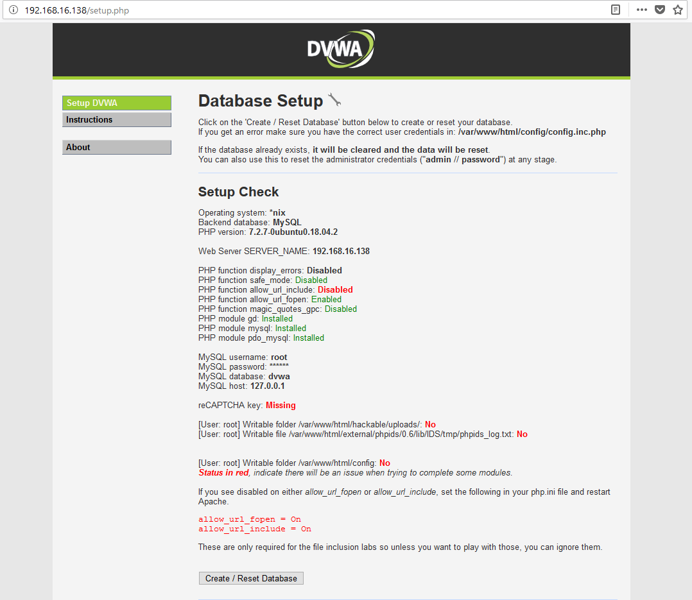
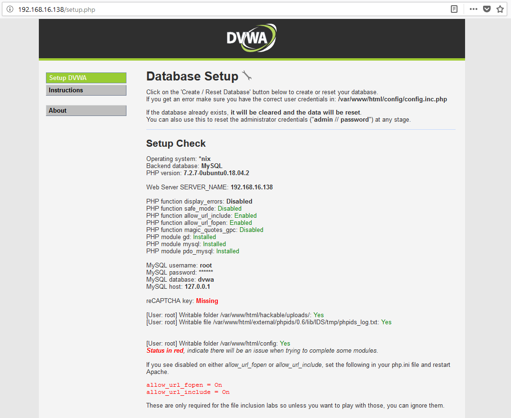
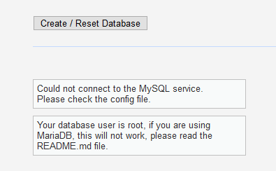
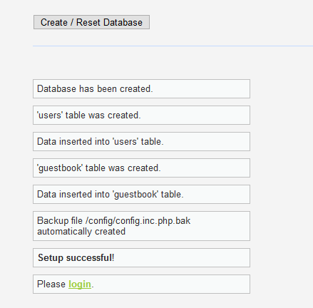
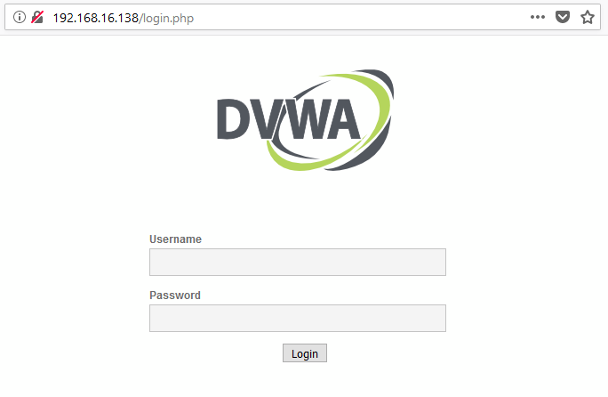

This tutorial covers how to install and configure the [Damn Vulnerable Web Application](https://github.com/ethicalhack3r/DVWA), or DVWA. 

## Contents

```toc
```

## Introduction

The authors summarize DVWA as:

> Damn Vulnerable Web Application (DVWA) is a PHP/MySQL web application that is damn vulnerable. Its main goal is to be an aid for security professionals to test their skills and tools in a legal environment, help web developers better understand the processes of securing web applications and to aid both students & teachers to learn about web application security in a controlled classroom environment.

This tutorial assumes you have a working install of Ubuntu Server version 18.04. This install can be on a physical machine, but most likely you will be using a virtual machine. When I installed and configured DVWA, I was using Ubuntu Server version 18.04 amd64. I also tested the install on Ubuntu Desktop version 18.04 amd64. Both worked using the same set of steps.

## Initial Steps

Make sure your Ubuntu system is up-to-date by checking and downloading any new packages:

```none
sudo apt update && sudo apt upgrade
```

Download the required packages to install DVWA:

```none
sudo apt install apache2 mysql-server php php-mysqli php-gd libapache2-mod-php git
```

When you install MySQL you might be prompted to enter a password for the root account. If you are, use the password: `p@ssw0rd`. This is the password that DVWA is configured for, and it makes life easier to not change the configuration. However, if you are not prompted to enter a password for the root account, it is most likely that you are using MySQL version 5.7 or above. In this case, there is a fix described further below in this post.

The above command to install the required packages does not specify what specific versions of the packages to download, so you will end up with the latest PHP and MySQL versions. The specific versions I installed were:

- `php`: `php7.2`
- `mysql-server`: `mysql-server-5.7`

We are now going to download DVWA from their GitHub repository. You can browse this repository using the following [link](https://github.com/ethicalhack3r/DVWA). First, we should make sure we are in the home directory of the current Linux user:

```none
cd ~
```

We are going to use the `git` command, to download the DVWA repository. Use the following command to clone the latest version of DVWA from GitHub:

```none
git clone --recursive https://github.com/ethicalhack3r/DVWA.git
```

The command above will download all the required DVWA source code files. Specifically, `git` will create a new directory in your home directory called `DVWA`. This directory will contain all the source code required to setup DVWA.

For the sake of complete documentation: the specific version of DVWA I used during my install is indicated by the following git object name: `e39ff4f`. If you want to clone this specific version, you can _reset_ the downloaded git repository, so you get this exact version. This step is not essential. But you can set the downloaded repository to the same version as used in this tutorial using the following command: `git reset --hard e39ff4f`. Note: you must be in the DVWA directory you downloaded to run this command.

Since we are installing DVWA on the Apache web server, we should remove the default index file (`index.html`) that is created when Apache is installed. Doing this will make way for the new index page (`index.php`) provided by DVWA. Remove the default Apache index page provided by DVWA using the following command.

```none
sudo rm /var/www/html/index.html
```

Now we want to copy the entire DVWA directory and contents to the `/var/www/html/` directory. This is the directory that Apache uses to _serve_ web pages to users. Anything in this folder will be available from the server. Please note, we are not putting DVWA in a folder in the `/var/www/html` directory, only the `DVWA` folder contents. This way, you do not have to use `DVWA` in the URL. Basically, I did this for simplicity.

The following command assumes you downloaded DVWA (using `git`) into your home directory. I would recommend making sure that DVWA downloaded correctly by checking the contents of this directory; for example, `cd ~/DVWA` and then `ls -la`. You should see all the DVWA source code files.

When you are happy to proceed, copy all the DVWA files that you downloaded to the `/var/www/html/` directory using the following command:

```none
sudo cp -r ~/DVWA/* /var/www/html/
```

Change to the web server directory:

```none
cd /var/www/html
```

It would be prudent to make sure that all the DVWA files have been copied across. You can check by listing the `html` directory using `ls -la /var/www/html` and you should see output similar to the listing below:

```none
student@ubuntu:/var/www/html$ ls -la /var/www/html
total 148
drwxr-xr-x  8 root root  4096 Jul 11 12:58 .
drwxr-xr-x  3 root root  4096 Jul 11 12:54 ..
-rw-r--r--  1 root root  3798 Jul 11 12:58 about.php
-rw-r--r--  1 root root  7296 Jul 11 12:58 CHANGELOG.md
drwxr-xr-x  2 root root  4096 Jul 11 12:58 config
-rw-r--r--  1 root root 33107 Jul 11 12:58 COPYING.txt
drwxr-xr-x  2 root root  4096 Jul 11 12:58 docs
drwxr-xr-x  6 root root  4096 Jul 11 12:58 dvwa
drwxr-xr-x  4 root root  4096 Jul 11 12:58 external
-rw-r--r--  1 root root  1406 Jul 11 12:58 favicon.ico
drwxr-xr-x  5 root root  4096 Jul 11 12:58 hackable
-rw-r--r--  1 root root   895 Jul 11 12:58 ids_log.php
-rw-r--r--  1 root root  4396 Jul 11 12:58 index.php
-rw-r--r--  1 root root  1869 Jul 11 12:58 instructions.php
-rw-r--r--  1 root root  4163 Jul 11 12:58 login.php
-rw-r--r--  1 root root   414 Jul 11 12:58 logout.php
-rw-r--r--  1 root root   199 Jul 11 12:58 phpinfo.php
-rw-r--r--  1 root root   148 Jul 11 12:58 php.ini
-rw-r--r--  1 root root  9180 Jul 11 12:58 README.md
-rw-r--r--  1 root root    26 Jul 11 12:58 robots.txt
-rw-r--r--  1 root root  4724 Jul 11 12:58 security.php
-rw-r--r--  1 root root  2931 Jul 11 12:58 setup.php
drwxr-xr-x 14 root root  4096 Jul 11 12:58 vulnerabilities
```

Once everything is looking good, copy the default DVWA config file so that it is usable by DVWA (Note: make sure you are in the `/var/www/html` directory when executing this command). The file `config/config.inc.php.dist` is provided as an example, but we will configure our system to match the configuration in this file. So no editing of this file is required.

```none
sudo cp config/config.inc.php.dist config/config.inc.php
```

Now would be a good time to view the DVWA web page to see if everything is working correctly. If you are using Ubuntu Desktop this process is very straight-forward. Open a web browser - Firefox is installed by default. Navigate to the following URL:

```none
127.0.0.1
```

If you are on Ubuntu Server, you cannot perform this task locally. You will need to have another computer, or virtual machine, on the same network. Check your IP address using:

```none
ip a
```

Open a web browser on another computer in the same network, and enter the IP address that appeared for your network adapter in the URL.

When you load DVWA for the first time, you will be presented with the setup page. This page displays the current configuration, and any errors that may be present. The page contains decent information on how to fix these problems too. Also, at the bottom of the page is a button to create the database for DVWA. We will use this in the future after we have finished configuring DVWA. For reference, my `setup.php` page is displayed below:



As you can see there are a few issues with the installation at the moment. We will fix these in the next section.

## Configuring DVWA 

The [README file](https://github.com/ethicalhack3r/DVWA/blob/master/README.md) provided by the DVWA authors does summarize a few configuration issues that may be encountered during installation. Most of these issues are currently apparent in our installation too. So we will go ahead and fix these. Without making sure these issues are resolved, the DVWA web application will not function as desired and some exercises will not work correctly. The following list documents the issues we will fix:

- Writable folder `hackable/uploads/`: No
- Writable file `phpids_log.txt`: No
- Writable folder `config/`: No
- PHP function `allow_url_include`: Disabled

The first three issues are all related to directory permissions. We will fix these first. At any time, feel free to reload the DVWA setup page in your browser to check if the issue has been solved. When resolved the issue will turn from red to green.

#### Permissions: `uploads` folder

The `hackable/uploads/` folder needs write permissions for the root account. First, check the permissions by listing the directory that the folder is contained in:

```none
student@ubuntu:/var/www/html$ ls -la /var/www/html/hackable/
total 20
drwxr-xr-x 5 root root 4096 Jul  9 17:41 .
drwxr-xr-x 8 root root 4096 Jul  9 17:43 ..
drwxr-xr-x 2 root root 4096 Jul  9 17:41 flags
drwxr-xr-x 2 root root 4096 Jul  9 17:41 uploads
drwxr-xr-x 2 root root 4096 Jul  9 17:41 users
```

I am unsure why DVWA is complaining because the folder is owned by the root user already and has write permissions. Nevertheless, by specifying the _other_ value in the permission set is configured for write permissions solves this problem. The current permissions set is: `rwxr-xr-x` or `755`. Simply, allow the _other_ value to have write permission using the following command:

```none
sudo chmod 757 /var/www/html/hackable/uploads/
```

You can check the permission set has been updated by listing the directory again and viewing the permissions for the `uploads` folder which should now read: `rwxr-xrwx`.

```none
student@ubuntu:/var/www/html$ ls -la /var/www/html/hackable/
total 20
drwxr-xr-x 5 root root 4096 Jul  9 17:41 .
drwxr-xr-x 8 root root 4096 Jul  9 17:43 ..
drwxr-xr-x 2 root root 4096 Jul  9 17:41 flags
drwxr-xrwx 2 root root 4096 Jul  9 17:41 uploads
drwxr-xr-x 2 root root 4096 Jul  9 17:41 users
```

#### Permissions: `phpids_log.txt` file

The `phpids_log.txt` file also needs write permissions for the root account. First, check the permissions by listing the directory that the folder is contained in:

```none
student@ubuntu:/var/www/html$ ls -la /var/www/html/external/phpids/0.6/lib/IDS/tmp/phpids_log.txt
-rw-r--r-- 1 root root 319 Jul  9 17:41 
```

The current permissions set for the file is: `rw-r--r--` or `644`. The file requires write access by the root user, however, setting this does not work (similar to the issue in the section above). Therefore, we will set the _other_ value to have write permission using the following command:

```none
sudo chmod 646 /var/www/html/external/phpids/0.6/lib/IDS/tmp/phpids_log.txt 
```

You can check the permission set has been updated by listing the directory again and viewing the permissions for the `phpids_log.txt` file which should now read: `rwxr-xrwx`.

```none
student@ubuntu:/var/www/html$ ls -la /var/www/html/external/phpids/0.6/lib/IDS/tmp/phpids_log.txt
-rw-r--rw- 1 root root 319 Jul  9 17:41 
```

#### Permissions: `config` folder

The `config` folder also needs write permissions for the root account. First, check the permissions by listing the directory that the folder is contained in:

```none
student@ubuntu:/var/www/html$ ls -la /var/www/html/ | grep config
drwxr-xr-x  2 root root  4096 Jul 11 13:00 config
```

The current permissions set for the file is: `rwxr-xr-x` or `755`. The file requires write access by the root user, however, setting this does not work (similar to the issues in the sections above). Therefore, we will set the _other_ value to have write permission using the following command:

```none
sudo chmod 757 /var/www/html/config
```

You can check the permission set has been updated by listing the directory again and viewing the permissions for the `config` folder which should now read: `rwxr-xrwx`.

```none
student@ubuntu:/var/www/html$ ls -la /var/www/html/ | grep config
drwxr-xrwx  2 root root  4096 Jul 11 13:00 config
```

#### Enabling PHP `function safe_mode`

The final issue we need to resolve is to set the PHP `function safe_mode` configuration to enabled. This is a configuration option for the PHP installation, so we need to modify the PHP configuration file, then restart the service. 

Open the `php.ini` file. Please note, that if you have a different PHP version that `7.2` you might need to change the path provided below. Feel free to use another text editor if you are not used to `vi`; for example, `nano` or `gedit` (if you are on Ubuntu Desktop).

```
sudo vi /etc/php/7.2/apache2/php.ini
```

The setting is quite a long way down in the file. For the PHP version I was using, the configuration was on line 840. I would recommend using the _find_ tool in `vi` or your text editor of choice, and search for the following text: `allow_url_include`. You should find a block of text, as displayed below:

```none
; Whether to allow include/require to open URLs (like http:// or ftp://) as files.
; http://php.net/allow-url-include
allow_url_include = Off
```

All you need to do is set the configuration to `On`, so it looks like the code below:

```none
; Whether to allow include/require to open URLs (like http:// or ftp://) as files.
; http://php.net/allow-url-include
allow_url_include = On
```

Now, restart the Apache service, so that the configuration is enabled:

```none
sudo systemctl restart apache2
```

#### Checking the DVWA configuration

It is recommended to re-check the setup page provided by DVWA again to ensure that the configurations we just set have worked correctly. The issues that were present before should be resolved.



One step we will not configure is to set the _reCAPTCHA key_. This configuration requires that you generate your own reCAPTCHA provided by Google and is beyond the scope of this post. Check the DVWA documentation for more information if you want to configure this setting and make the reCAPTCHA exercise available.

There is one last set to perform, creating the database for DVWA. This step is exceptionally important, as, without the database, the DVWA exercises will not function correctly. The database connection can be problematic, and ease of setup depends on the version of MySQL you are using.

Try to create the database by clicking the **Create / Reset Database** button on the DVWA setup page. You will be presented with output at the bottom of the page that specifies any errors. If you are following this tutorial, and are using MySQL version 5.7, you will get the following error message.



## Re-configure MySQL root account

Unfortunately, the root account will not work with DVWA due to the way MySQL is built in version 5.7. If you are using an older version than 5.7, this step will not apply. You can test the database install using the following command:

```none
mysql -uroot -p
```

If you are able to login with the password: `p@ssw0rd`, everything should be working fine. However, if you cannot, you will need to fix the access for the root account. Apparently, [MySQL 5.7 changed the security model](https://zenidas.wordpress.com/recipes/mysql-5-7-root-login-without-sudo/), so that root login requires sudo. We will fix this issue, and re-create the root account and specify the permissions we desire. The following steps are not recommended for deploying a web application, as we should lock down the database and not use the root account. However, we are installing an intentionally vulnerable web application... hopefully, in a testing environment!

Start by logging into the MySQL command prompt:

```none
sudo mysql -uroot
```

Since there is no password configured by default, you should not be prompted to enter a password. Start by removing the root user from the MySQL table of users:

```sql
mysql> DROP USER 'root'@'localhost';
Query OK, 0 rows affected (0.00 sec)
```

Now create the root user again:

```sql
mysql> CREATE USER 'root'@'localhost' IDENTIFIED BY 'p@ssw0rd';
Query OK, 0 rows affected (0.00 sec)
```

Specify that the root user should have permission to access anything!

```sql
mysql> GRANT ALL PRIVILEGES ON *.* TO 'root'@'localhost' WITH GRANT OPTION;
Query OK, 0 rows affected (0.00 sec)
```

Ask MySQL to reload all configuration and permissions:

```sql
mysql> FLUSH PRIVILEGES;
Query OK, 0 rows affected (0.00 sec)
```

Now exit the MySQL prompt:

```none
mysql> exit
Bye
```

It is recommended that you check that the problem has been resolved. Try to login to the MySQL prompt again, this time using the same username and password that DVWA uses:

```none
mysql -uroot -pp@ssw0rd
```

Once again, you should have entered the MySQL prompt. Remember, you can leave this prompt by using the `exit` command. If this works, we have finished the MySQL configuration and can head back to DVWA to create the database.

## Creating the DVWA Database

Head back to your web browser and try to create the database again. This time, we should be successful and see the following output:



If the database is created successfully, you will be redirected to the login screen:



The following credentials can be used to login to DVWA:

- username: `admin`
- password: `password`

## Conclusion

This tutorial summarized how to install and configure Damn Vulnerable Web Application, or DVWA, on Ubuntu Linux version 18.04. Although the tutorial instructions are specific to Ubuntu Linux (Desktop or Server), the tutorial should provide suitable discussion and advice for other Linux distributions, such as Kali Linux. I hope that the tutorial helped someone, and, as always, please leave a comment if you have any questions or feedback. Also, if you are interested in a tutorial about completing any of the DVWA exercises, please leave a comment - I could also be interested in documenting the methods used in each exercise. Thanks!