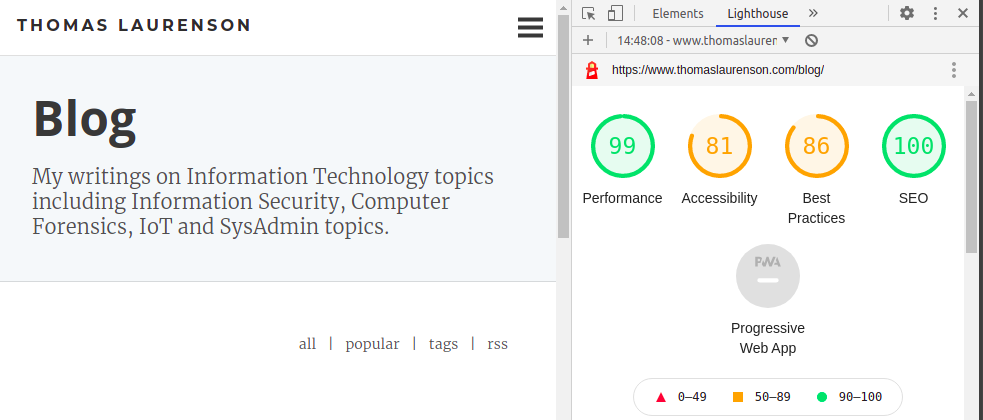
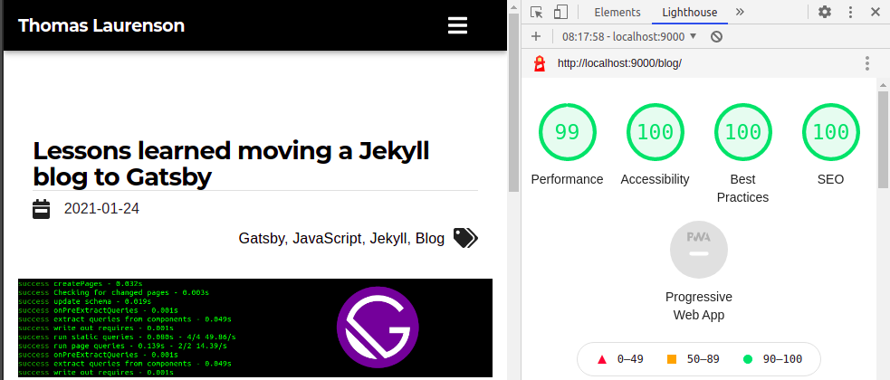

Been a while since I blogged about stuff. The perils of changing jobs and moving cities numerous times in the last couple of years put a bit of a block on any progress. Looking at my personal website/portfolio in 2021 made me a little sad - outdated and unloved. So, I took some time to do a rewrite using some of the skills I have learned since I last was developing the website - namely JavaScript, React, and Gatsby. This blog is a discussion of the process and some of the more interesting things that happened along the way.

## Contents

```toc
```

## A Brief History

Maybe some context will help outline why I wanted to convert my rewrite my website and blog. My old website was written using [Jekyll](https://jekyllrb.com/) and it worked well. Jekyll was generally easy to manage and was simple to write and publish blog posts written in markdown. But it comes with some problems. Or, a better way to summarise it, there were some things I didn't like.

Jekyll is written in Ruby. I don't write in Ruby much, don't understand it in detail, and have no real need to start writing or learning Ruby. This means the only reason I have a Ruby environment is for my blog. I haven't even installed Ruby on my laptop for about a year. Similar to other devs, I made a [Docker](https://www.docker.com/) solution for blog development - but it was a little slow and clunky. Especially when the Docker environment was not used to deploy - as I used GitHub pages.

Another big point was I have been doing lots of Node development, including some React, as well as getting better at modern JavaScript. We use React at my work, and it also seems to have become ridiculously popular. All were reasons I started learning it. So why not have a blog written in a Node environment using React.

Another reason I wanted to rewrite the blog was to get some modern functionality that was easy to implement. Things like progressive image loading, offline access, asset pipelines, component design, and overall better performance. A quick review of my current Jekyll website performance using Chrome Lighthouse shows room for improvement - and a very boring-looking website.



I always find a good starting point with a new project is to define a few guidelines for what I want to achieve:

- Move to a new stack - the big part!
- Create a beautiful, elegant and sleek UI and better UX
- Improve website performance and Lighthouse scores
- Expand website content to include a portfolio of projects and summary of skills

## Picking a Static Site Generator (SSG)

I did a lot of research about Static Site Generators (SSG) before choosing a solution. FYI - SSGs help ease the building of a website by processing content and using templates, instead of writing every single page from scratch. Have a read of [What is a Static Site Generator?](https://www.netlify.com/blog/2020/04/14/what-is-a-static-site-generator-and-3-ways-to-find-the-best-one/) if you want more info. Jekyll is an SSG, so I thought a modern Node-based SSG would be a good framework.

So I wanted an SSG that was based on, or compatible, with React - mainly because I wanted to get better at React. A couple of frameworks kept popping up in Google searches:

- [NextJS](https://nextjs.org/)
- [Gatsby](https://www.gatsbyjs.com/)


One great page I found comparing Jekyll and NodeJS alternatives was a [Comparison of Gatsby vs Jekyll vs Hugo](https://www.gatsbyjs.com/features/jamstack/gatsby-vs-jekyll-vs-hugo) and a [Comparison of Gatsby vs Next.js](https://www.gatsbyjs.com/features/jamstack/gatsby-vs-nextjs/). Another one was [Gastby vs Next.JS](https://dev.to/jameesy/gatsby-vs-next-js-what-why-and-when-4al5). Overall I thought that both, Gatsby and NextJS, seemed highly suitable. So how to choose which one? I always find that trying out some of the tutorials, sample projects, etc., and seeing how I like them. For this process, I used the following tutorials and codebases:

- [Create a Next.js App](https://nextjs.org/learn/basics/create-nextjs-app) and the [source](https://github.com/vercel/next-learn-starter/tree/master/demo)
- [Getting started with Gatsby](https://www.gatsbyjs.com/docs/quick-start/) and [Gatsby's blog starter](https://github.com/gatsbyjs/gatsby-starter-blog)

This sort of thing takes time - about half a day, or 4 hours or so in this case. But I always think the time is worth it. The process gives you some real experience before making a final decision.

> **Lesson learned:** Do research before making choices and, most importantly, try out some small projects and review the code. In short, try to build something simple using the framework.

To cut to the chase, after some experimentation and reading... I decided to go with Gatsby. I found the tutorial easy to follow and loved the idea of getting to know more about GraphQL - which Gatsby utilizes. Plan formed. Time to do some coding and make something beautiful. 

## Jekyll to Gatsby? Easy?!

This section documents some commentary on some of the important aspects of getting started with Gatsby, creating the new website, and porting content across.

### Choosing a Gatsby Starter

According to Gatsby docs, [Starters](https://www.gatsbyjs.com/starters/?) are boilerplate projects that Gatsby developers can use to set up a new site quickly. There are so many starters available, from simple small blog-style starters to larger portfolio + blog starters that are almost ready to be deployed. Choosing one can be hard. I always like to pick a simple starter - as I will probably want to change most of the style and layout.

I ended up going with [Gatsby's blog starter](https://www.gatsbyjs.com/starters/gatsbyjs/gatsby-starter-blog) - because it was simple, and the most popular. It provided a very solid foundation to grow, but enough substance to get a good idea of how Gatsby works. But that doesn't mean the other starters are not useful. They are all open source and you can check GitHub for the source to see how others build stuff. 

> **Lesson learned:** Instead of just relying on the framework docs, see how other developers design and code by reviewing other Gatsby starters

### Existing Blogs

Since I already had content I needed to migrate it to a new framework. Since my original website was pretty small, this was mainly about 20 blog posts - all written in markdown with frontmatter used by Jekyll to create the HTML pages using templates.

I was hoping to not modify any of this content - to save time. I wanted to copy all the blog posts to a folder in my new Gatsby project, and it would create some lovely HTML blog posts. Think I was dreaming about this working well! To give you an idea of the front matter, here is an excerpt of what I started with:

```none
---
layout: post
title: "Metasploitable3 - Pentesting the Ubuntu Linux Version (Part 1: SQL Injection)"
tags:
- Metasploitable3
- PenTesting
- SQL Injection
thumbnail_path: blog/thumbs/padlock.png
---
```

If I was better at GraphQL when I started this process, I probably could have achieved this transition with not too much problem. I found lots of tutorials:

- [Migrate from Jekyll to Gatsby](https://www.gatsbyjs.com/blog/2017-11-08-migrate-from-jekyll-to-gatsby/)
- [From Jekyll to Gatsby: 7 Simple Steps](https://medium.com/javascript-in-plain-english/from-jekyll-to-gatsby-7-simple-steps-98e0b7a5ead2)
- [How I migrated my site from Jekyll to Gatsby](https://www.acuriousanimal.com/blog/2019/10/03/from-jekyll-to-gatsby)

I ended up wanting to change so many things, adding more fields (e.g. redirects, blog description, and date) that rewriting the frontmatter manually seemed easier. This is a snippet from the same post as displayed above, with updated fields.

```none
---
title: Metasploitable3 - Pentesting the Ubuntu Linux Version (Part 1)
description: Walkthrough of Pentesting the Metasploitable3 Ubuntu Linux version using SQL Injection.
tags: ["Metasploitable3", "Pentesting", "SQL Injection"]
thumbnail: metasploitable3.png
date: 2018-07-08
redirect_from:
  - blog/2018/07/08/metasploitable3-pentesting-the-ubuntu-linux-version-part1/
---
```

This was a tough decision - to rewrite the frontmatter and change the blog URLs. FYI - I used the `gatsby-plugin-meta-redirect` Gatsby plugin to do this based on the `redirect` value in the frontmatter.

> **Lesson learned:** Sometimes taking a more manual approach may be the better option in the end. It gave me the option to change things I wouldn't have otherwise changed.

### Automating Markdown Changes

For those who have used Jekyll, they might know that it uses [Liquid](https://jekyllrb.com/docs/liquid/) templating language to process templates. You can handle do things like declare variables and use if/else logic. Problem: It needs to be changed to work with Gatsby.

Maybe I have a problem with automating everything. I knew this was a one-off - but I thought I could write some scripts to change markdown quicker than I could change them manually. I think that with 20 blog posts, this was right on the border of whether it could be useful to automate. Any more and automation would be the best option, any less and it wouldn't. But I guess it depends on how quickly you can whip up a couple of simple scripts. Python is my go-to language - so this only took about an hour. 

For those doing a similar transition from Jekyll to Gatsby here is a list of things I changed:

- Syntax highlighting syntax
- Image inclusion syntax
- Markdown frontmatter
- Table of contents syntax

To give a little idea of things that needed changing... A before and after example of syntax highlighting:

- Before: 
- After: \`\`\`sql

I automated this by simply finding and replacing text in Python. Some regex was used, but that was only because I have written lots of regex lately, and found it quick! For once! Overall, this made the changed much more tolerable (for me personally).

> **Lesson learned:** Automating can sometimes not be worth it. But if you like automating more than manually doing stuff, it can make life more fun!

## Designing the Portfolio and Blog

At this point, I had a bunch of existing blog posts written in Markdown that had all been updated to work well in Gatsby. Time to start developing the website.

### Choosing a Component Framework

Ease of development! When it comes to full-stack, I like to chill in the back seat, more than riding upfront. Translation: I am not very good at web development, it isn't my favorite thing to do. But I like learning more! Also... this is 2021, so I want some help! The new portfolio/blog I wanted should look good, be non-generic, and quick to develop. So choosing a component library was important to me to help speed up development. This may not always be the case and may depend on your experience, time available, and dedication.

If you haven't heard of the term _component library_, my informal definition is: a standardized library of useful things to build your website. Where _things_ are stuff like buttons, nav menus, loading indicators, and layout controls. So, instead of writing and styling everything from scratch, you get a **big** helping hand.

There is no shortage of options available. This is indicated by [Top 10 React Component Libraries for 2020](https://blog.logrocket.com/top-10-react-component-libraries-for-2020/). Seems like every React thing I search for has a Top 10 list of options! Anyway, picking one can be daunting. Some of the options I weighted up were:

- [React Bootstrap](https://react-bootstrap.github.io/): I had used Bootstrap4 in the past and it seemed like a good option
- [Ant Design](https://ant.design/): I keep reading comments on Reddit of devs who love Ant Design
- [Material UI](https://material-ui.com/): I have a half-finished dashboard using Material UI and I like using it.

Similar to picking the right React framework for the blog (Gatsby vs NextJS), I used the same method. [Create a New React App](https://reactjs.org/docs/create-a-new-react-app.html) and install each component library and try it out. In the end, Material UI was the winner. Why? I had used it before, and the experience I had could speed up development time. This meant I could take more time learning Gatsby and GraphQL instead, as well as focussing on the smaller things.

> **Lesson learned:** Choosing a good component library can make life much easier, speeding up development time. The downside is you can get stuck with a generic style that might be hard to modify.

### Finding Inspiration

I am by no means naturally proficient in design or UX. I can do it with lots of time and redesign. But it is not something I have trained in. I barely take in website aesthetics when I am browsing, so I am coming to the table with minimal knowledge. This means getting design inspiration is essential.

I started by reading articles like [10 Awesome Web Developer Portfolios](https://codeburst.io/10-awesome-web-developer-portfolios-d266b32e6154) and [15 Web Developer Portfolios to Inspire You](https://www.freecodecamp.org/news/15-web-developer-portfolios-to-inspire-you-137fb1743cae/). These articles are pretty good and do provide lots of examples. I found one especially beautiful portfolio from [Adham Dannaway](https://www.adhamdannaway.com/) that I took lots of inspiration from. I liked some parts of Adham's portfolio and how he visually displayed information.

However, just a few good portfolio examples were not sufficient for me. I recently noticed that lots of emerging or aspiring developers post their new portfolios on the `/r/webdev` Reddit - and other similar subreddits. I looked for posts containing `portfolio` and did some research. The best part about this is that the (mostly) lovely and caring Reddit communities post a really good feedback to the author. This info was priceless, and I learned lots of pro tips.

### Redesigning Everything

I don't want to go into detail about how I went about redesigning my website - just a high-level overview. The source code is stored on GitHub in my [`thomaslaurenson.github.io` repository](https://github.com/thomaslaurenson/thomaslaurenson.github.io). Feel free to check it out and see how I went about implementing some specific things. Instead, I will write some separate blog posts that target specific implementation steps that I couldn't find much information on the Internet.

As a summary, here is a screenshot of the new blog being tested on Chrome Lighthouse. Some pretty good gains in all areas.



## Deploying a Gatsby Blog on GitHub Pages

The final part of the website redesign was to find an easy way to deploy the production build of Gatsby to [GitHub pages](https://docs.github.com/en/github/working-with-github-pages/about-github-pages). Why GitHub Pages? Free, easy, fast content delivery and my current website were deployed the same way. With Jekyll, you can just push to `master`, and the website will be build and deployed. Magic! Gatsby is not as easy but is very manageable.

[GitHub Actions](https://github.com/features/actions) seems to be the hot new thing out. I have been using it a little to automate builds and deploys of other projects. So it was my automatic decision. This was against the advice from the Gatsby docs on [How Gatsby Works with GitHub Pages](https://www.gatsbyjs.com/docs/how-to/previews-deploys-hosting/how-gatsby-works-with-github-pages/) - who recommend using the `gh-pages` package and something like:

```none
npm install gh-pages --save-dev
gatsby build && gh-pages -d public -b master
```

Nothing wrong with this solution, in fact, it is pretty cool! See the tutorial linked above for a complete rundown of this method. But I wanted to do some CI/CD stuff and keep learning GitHub actions. They have a Travis CI example, but due to the pricing changes of Travis - I have stopped using them. So Actions it was.

I found a very simple Action on the Marketplace called [Gatsby Publish](https://github.com/marketplace/actions/gatsby-publish). These Actions make it very simple to put together an extensible process to build, test and deploy code. I barely changed the code in the Action example. My final solution is listed below:

```yml
name: Gatsby Publish

on:
  push:
    branches:
      - dev

jobs:
  build:
    runs-on: ubuntu-latest
    steps:
      - uses: actions/checkout@v1
      - uses: enriikke/gatsby-gh-pages-action@v2
        with:
          access-token: ${{ secrets.ACCESS_TOKEN }}
```

The only change I made was pushing my website project code to a new branch named `dev`, which then publishes the building website to the master branch when changes are made. Easy!

## Conslusion

Hope you got this far or at least got something interesting from this blog post. I usually do a more technical write-up, but I thought that this experience earned some high-level discussion of how I went about the migration from different frameworks. There is so much information, documentation, and tutorials that it is hard to make decisions, or knowing which option may suit you the most. The entire process was fun and rewarding. Hopefully, it encourages me to start blogging again.
