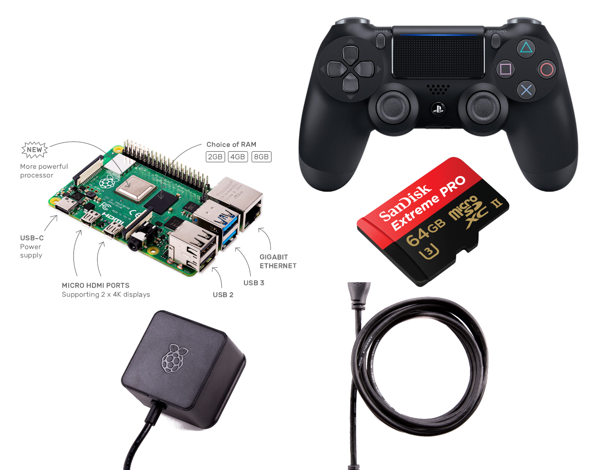
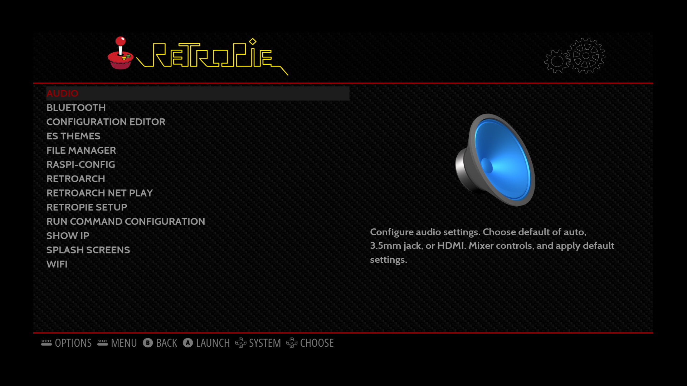
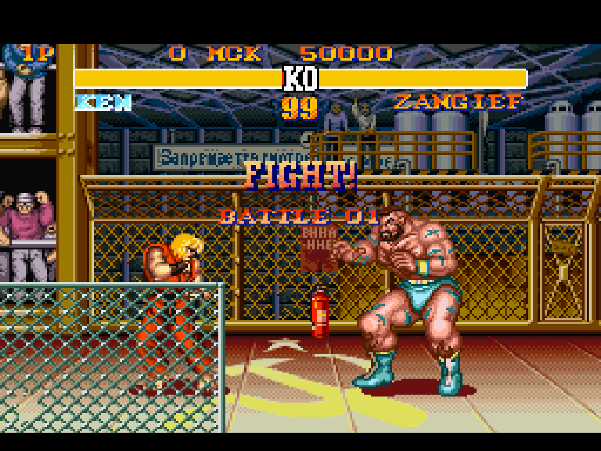

I have wanted a retro gaming setup for about 10 years! I have dabbled with a little emulation of older consoles from my childhood - things like Sega Mastersystem, Playstation 1, and Amiga 500 emulation. In the past, I just set up an emulator on my Linux laptop (Thinkpad BTW) played around a little, tweaked some settings, then got bored. The problem was I wanted more games, more emulators for different platforms, and a proper controller instead of a keyboard/mouse. However, the biggest thing I wanted was to play something, not on my laptop. I sit at it all day for work, then after work for fun. I needed some better balance. I needed a console. Then I could be lazy and sit on the couch playing games! 

The solution: one Raspberry Pi and the RetroPie project. This blog takes us on a journey of me buying all the components and setting up a retro gaming console in a single day. This is not a tutorial per-se, but I have included some useful lessons learned.

)")

## Contents

```toc
```

## 10.27 am: Buying the Equipment

After a Saturday morning breakfast, I grabbed my wallet and headed to my favorite tech shop. It's not my favorite, I just noticed they had the Pi 4 on sale that weekend. Anyway, while I was there I picked up the following items:

- [Raspberry Pi 4 Model B - 8GB](https://www.raspberrypi.org/products/raspberry-pi-4-model-b/) for $120
- [Raspberry Pi 15.3W USB-C Power Supply](https://www.raspberrypi.org/products/type-c-power-supply/) in Black for $12
- [Micro HDMI to Standard HDMI Cable](https://www.raspberrypi.org/products/micro-hdmi-to-standard-hdmi-a-cable/) in Black for $14
- [DualShock 4 Wireless Controller](https://www.playstation.com/en-nz/accessories/dualshock-4-wireless-controller/) for $89
- [Sandisk Extreme Pro 64GB](https://shop.westerndigital.com/en-au/products/memory-cards/sandisk-extreme-pro-uhs-ii-microsd) for $47

If the prices look high, they are in $NZD. And generally, tech is a little more expensive here. Adding everything together, a total of $282.



There are lots of tutorials about building a RetroPie, and everyone uses slightly different equipment. There are lots of recommendations to get a bundled pack - a good choice, but I am quite picky. Here is my rationale for each item:

- **Raspberry Pi 4 Model B - 8GB**: The only Raspberry Pi I currently has a version 2. I wanted more grunt - mainly to be able to emulate PlayStation 1 games. So I went with a new Pi 4. I also got the 8GB version, the highest RAM option available. The cost difference is not much, and I wanted to squeeze any performance possible out of it.
- **Raspberry Pi 15.3W USB-C Power Supply**: Why not get a cheaper power adapter from AliExpress. Yes, it would save money. But when it comes to power supplies I want quality. The bonus is that buying the official ones supports the Raspberry Pi Foundation, and they are awesome. So why not.
- **Micro HDMI to Standard HDMI Cable**: Since the Pi4 has a micro HDMI output port, I needed a cable to go to my TV. Not much else to say about it.
- **DualShock 4 Wireless Controller**: RetroPie supports so many controllers that picking one is hard. I looked at many options and picked the PS4 because it is still available from retail shops, has Bluetooth, and I like the style of the controller. Controller support in RetroPie is awesome, so the controller seems like a personal choice.
- **Sandisk Extreme Pro 64GB**: It seems sensible to buy a MicroSD with decent speed. I didn't have any spare MicroSD cards, so I just bought a new one, that had semi-decent capacity. I want to add an SSD in the future, so a massive MicroSD card seemed a waste of money.

## 11.03 am: Initial Installation

Got home with all my new goodies! Time to do some tinkering! I have not had much exposure to using the Raspberry Pi - so I was reading lots of tutorials and blogs along the way. However, the **main documentation I followed** was the [RetroPie First Installation guide](https://retropie.org.uk/docs/First-Installation/).

The first task is to download the RetroPie image and write it to my new flashy MicroSD card. I downloaded the latest RetroPie version: `4.7.1`.

The [installation instructions on the RetroPie guide](https://retropie.org.uk/docs/First-Installation/#installation) are quite long and have various steps about installing software to write the RetroPie image to the SD card. Great to see such thorough documentation, but on Linux, this is a couple of commands task. I would not recommend following these instructions blindly. This is just a method I used on my Linux system, that I found simple and easy. So I documented them mainly for myself. **Be careful with the `dd` command**!!!

Download the RetroPie image:

```none
wget https://github.com/RetroPie/RetroPie-Setup/releases/download/4.7.1/retropie-buster-4.7.1-rpi4_400.img.gz
```

Check the RetroPie MD5 checksum:

```none
echo "1ea0cbf19991273cc8b50bbca7b52806  retropie-buster-4.7.1-rpi4_400.img.gz" | md5sum -c -
```

Copy image to MicroSD card:

```none
sudo dd bs=4M if=retropie-buster-4.7.1-rpi4_400.img of=/dev/sda conv=fsync
```

Next, I remove the MicroSD card and inserted it into my RaspberryPi. Then connected the following cables:

- Connected HDMI cable to my TV
- Connected a USB keyboard I had laying around
- Connected my PS4 controller via USB
- Connected the UBS-C cable and powered on the device

## 12.41 am: RetroPie is Alive!

I was anticipating numerous technical issues when first using my new RetroPie system. I did encounter some issues, but they were all pretty minor. The RetroPie system is super easy to use and customize, and very flexible.

### Basic Configuration - WiFi and SSH

In the RetroPie Docs First Installation guide, there is a section on [How to connect to WiFi](https://retropie.org.uk/docs/First-Installation/#wifi). They recommend using the RetroPie Configuration available in EmulationStation. I should have read this guide completely because I didn't follow this excellent guidance! Instead, I exited EmulationStation to get to the terminal, and connected using the `raspi-config` command. **Lesson learned - the RetroPie configuration option in EmulationStation has a bunch of useful tools to avoid directly using the terminal - including `raspi-config`.**

If you want to transfer ROMS to your RetroPie, you have a couple of options. I am a diehard Linux terminal fan, so I wanted to copy ROMS from my laptop, via SSH, to the RetroPie. Either by using the `scp` command or by using [FileZilla](https://filezilla-project.org/) under SCP mode (more on that in a little bit). But you need to enable the SSH server on the RetroPie first. I did this by exiting EmulationStation and **starting the SSH service from the terminal. Wrong!** The easier method is to use the `raspi-config` tool, which is available from the terminal, but more easily available from the EmulationStation menu. The [RetroPie Docs on Enabling SSH from the RetroPie menu](https://retropie.org.uk/docs/SSH/#option-2-from-the-retropie-menu) outline how to do this. **Lesson learned - the RetroPie configuration option in EmulationStation has the raspi-config tool.**



With the RetroPie connected to my WiFi network, and SSH enabled - it makes sense to set a new password and get rid of the default. I couldn't find an easy way to do this through the RetroPie configuration in EmulationStation (I could be wrong). Instead, I used the terminal and ran the `passwd` command.

```none
sudo passwd pi
```

When you run the command, make sure to enter your new password twice!

### First Game

I had a couple of SNES ROMS sitting around from when I last emulated games on my laptop, so I used one to test. I picked my all-time favorite - Street Fighter II Turbo for the Super Nintendo (or SNES). I copied the ZIP file to the `~/RetroPie/roms/snes` folder and restarted EmulationStation. After restarting, I loaded up the game and was playing a classic retro game.



In summary, **in approximately 3 hours I had bought all the parts, installed the base system, and was playing Street Fighter II Turbo on a SNES emulator.**

## Lessons Learned

Instead of including some of the issues I encountered throughout this blog, I decided to make some small subsections about issues I encountered, things I learned as a RetroPie noob, and some pro tips.

### Where do I get ROMS for my new RetroPie?

It took me a while to find out where to get ROMS. The RetroPie Docs do not state much about this - due to copyright reasons.  Completely understandable, but it makes it difficult as a new user. There is a great article [Is Downloading Retro Video Game ROMs Ever Legal?](https://www.howtogeek.com/262758/is-downloading-retro-video-game-roms-ever-legal/) that discusses ROM legality - a good read. I gave away my Master System 2 and PS1 consoles and games (context: I am a bit of a minimalist), so I don't have the originals. I threw out my working Amiga 500 and games collection when cleaning up my parent's house (a bad decision in hindsight). I love supporting people who make great stuff by buying their products - but it is really hard to do this easily in the ROM world. It would be amazing if there was a Steam-style ROM provider - but I am dreaming that this is ever going to happen. Anyway, a good place to find ROMs would be reading the pinned message on the [/r/Roms subreddit](https://www.reddit.com/r/Roms/). **The pinned thread is named: Roms Megathread 3.0 Ybin Edition.**

### Where do I put my ROMS in the RetroPie and in what file format?

This is pretty simple, and probably common knowledge for lots of people. But I found it a little difficult at first. There is a folder in the `pi` user's home directory called `roms`. In here, there is a bunch of subfolders for different emulators. So the `snes` folder is for Super Nintendo, and the `psx` folder is for PS1 games.

So we know where to put the ROMS... but what file format should be used? ROMS come in a variety of file formats. Each **Emulators** section in the RetroPie Docs has extensive information about each specific console/emulator. Let's use [SNES](https://retropie.org.uk/docs/Super-Nintendo-Entertainment-System/) as an example. The SNES emulator accepts a bunch of file types including: `.7z`, `.bin`, `.bs`, `.fig`, `.mgd`, `.sfc`, `.smc`, `.swc`, and `.zip`. I like using archive file formats to save space - especially for emulators which require less processing power, so that decompression will not adversely affect gameplay. From some quick reading it seems some formats are better than others - something I will continue to research.

### How do you transfer ROMS to your RetroPie via SSH?

The RetroPie Docs have a great page on [Transferrin ROMs](https://retropie.org.uk/docs/Transferring-Roms/) with various options. The section for SFTP (also known as SCP) is pretty bare. I seem to forget SCP commands so I thought I would document them here. With SSH enabled on the RetroPie, this is easy. You can copy ROM files using the `scp` command. The **general structure of the command** is:

```none
scp myrom.zip username@ipaddress:/location/on/pi/to/copy/to
```

**To provide an example.** I have a SNES ROM called `SF2Turbo.zip` and want to copy it from my laptop to the `~/RetroPie/roms/snes/` folder on my RetroPie. 

```none
scp SF2Turbo.zip pi@192.168.1.71:/home/pi/RetroPie/roms/snes
```

If the terminal is not your thing - or you don't have the SCP command (Windows), an excellent alternative is a graphical tool [FileZilla](https://filezilla-project.org/) - developed by the same people who make Firefox. Here is a good tutorial on [How to use SCP in FileZilla](https://www.bettertechtips.com/how-to/use-scp-filezilla/) if you are interested. **Lesson learned: SCP is an excellent, easy and fast method to transfer data to and from the RetroPie.**

### Where do I get different BIOS files for my new RetroPie?

Some emulators require a BIOS to play games. If the console/emulator you are using is in [this list](https://retropie.org.uk/docs/BIOS/) - you will need a BIOS. Additionally, some games will run better with a BIOS. This still leaves the question... Where do you get a BIOS from? At first, I tried Googling the BIOS name - which works well as they are usually unique. Using the PS1 as an example, one of the BIOS names is: `scph101.bin`. A good way to check the BIOS you have is legit is by calculating a hash of the file. RetroPie provides MD5 hashes on each console/emulator page. Have a look at the [BIOS section of the PS1](https://retropie.org.uk/docs/Playstation-1/#bios) and look for the MD5 column. This is how I validate the files in Linux:

```none
echo "6E3735FF4C7DC899EE98981385F6F3D0  scph101.bin" | md5sum -c -
```

OK - I still haven't answered the question: where do you a BIOS from? On my journeys I found a couple of GitHub repos that provide lots of these BIOS files:

- [RetroPieBIOS](https://github.com/archtaurus/RetroPieBIOS)
- [retroarch_system](https://github.com/Abdess/retroarch_system)

Both projects provide hashes to validate the BIOS files - and seem pretty legit (haven't done a complete repo review). They determine valid BIOS files by comparing against the Libretro database, specifically the [`System.dat` file](https://github.com/libretro/libretro-database/blob/master/dat/System.dat). **Lesson learned: Didn't learn this, but it is important... Get files from reputable sources and validate!**

### Why is my PS4 controller blinking white when connecting to the RetroPie via USB?

When I first connected my PS4 controller via USB to the RetroPie the controller light kept blinking white. I thought it was not charged at first - but it was. So it seemed like a connection issue. After a quick search, it seemed other users experienced the same issue, which was caused by a USB cable that could not provide enough power. I changed from a phone USB cable to a portable speaker USB cable. Problem solved! **Lesson learned - try another USB cable**.

### How can I connect my PS4 controller to my RetroPie using Bluetooth?

There seem to be a bunch of options for connecting a PS4 controller to a RetroPie via Bluetooth. The [RetroPie Docs on the PS4 controller](https://retropie.org.uk/docs/PS4-Controller/) outline 4 different methods. I choose to connect the controller using the built-in Bluetooth module on the Raspberry Pi 4 - as it seemed the easiest. I don't want to admit it, but I struggled with this for a while. I used the `raspi-config` tool to try and pair the device, with no success. The docs state the following:

> To put the controller into pairing mode, press and hold the Share button then the PS button.

Sounds easy?! Maybe I am an idiot because (to me) it reads: Press and hold the Share button, press the PS button and then release both. Nope! **Press and hold** both buttons, and keep holding! **Lesson learned: Press and hold, and learn to read**!!!

## Conclusion

So far, I have only just scratched the surface with my new retro gaming console. Life is good! I haven't had a console for about 15 years - so it is nice to have a lounge + TV gaming setup. But there is still lots to do, including:

- Get a case! ASAP!
- Get another controller for 2 player games
- Tweak settings, improve performance, etc.

Hope you enjoyed this post and learned something from it. Hopefully, I will be back with some more RetroPie or Raspberry Pi-themed posts - as this has been an awesome experience so far. Until then, I will continue my mission to complete every Tony Hawk Pro Skater game...
