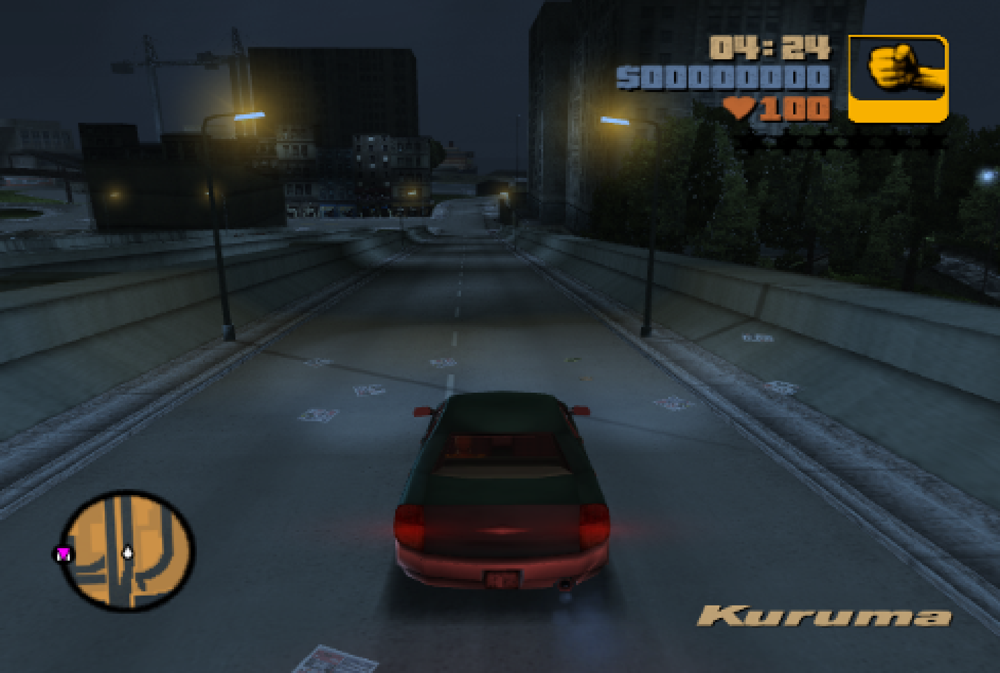
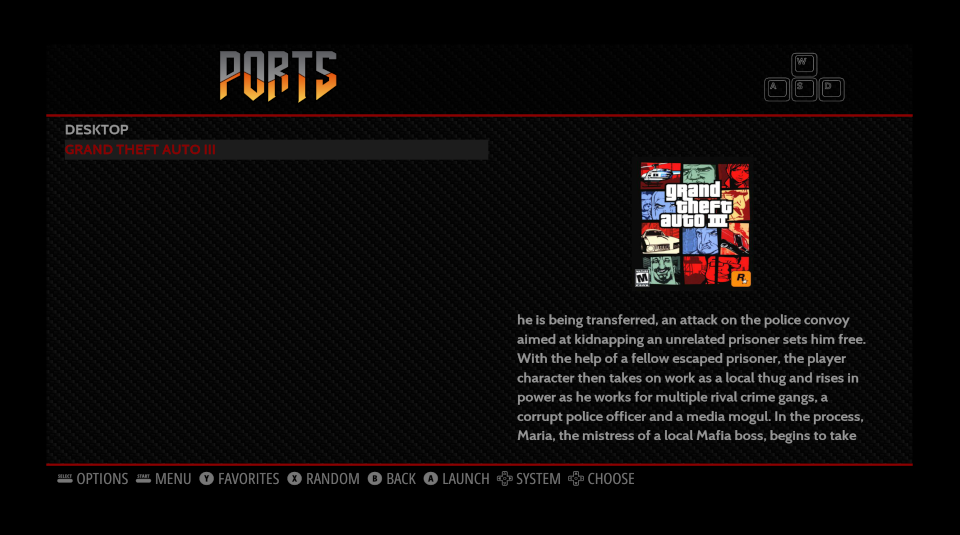

My last post was about [Building a retro gaming machine in a day](/blog/2021-02-20/retropie-building-a-retro-game-console-in-a-day)- where I got a Raspberry Pi 4, a PS4 controller, and installed RetroPie. It was a blast to play some SNES, PS1, and Amiga games. But like usual, I seem to have more fun tinkering with these things than playing games for hours on end...

I recently stumbled on an interesting project called **re3** - a reverse engineering project of the original Grand Theft Auto 3. After a little reading, I discovered the project had excellent Linux support. To spice things up, there were a couple of GitHub issues posted about people running it on a Raspberry Pi - as well as some official build instructions which included ARM instructions! Victory! Getting GTA3 running on my RetroPie seemed like my next adventure. Spoiler - it works, and pretty well.



## Update: 2021-02-10

Unfortunately, the **re3 project on GitHub has been subjected to a DCMA take-down notice**. This means the project source code is not available from the original GitHub repository, and updates to the project seem unlikely. However, I had already written most of this blog post and thought I would publish it anyway.

The source seems to be available from various locations - guess the Internet doesn't forget! The data collection enthusiasts at `/r/DataHorder` live for this stuff. One post I found was: [Archived GTA III and VC Reverse Engineered Code Repo](https://www.reddit.com/r/DataHoarder/comments/loctpb/archived_gta_iii_and_vc_reverse_engineered_code/).

Without getting too deep into the ethics of this debacle - I purchase a genuine Windows copy of GTA3 from Steam - specifically to play the re3 version on my Raspberry Pi. So I feel I can sleep soundly at night, supporting the original creators on a platform they never intended to support and (most likely) never will.

## Contents

```toc
```

## Setup re3 Environment

This section will get us set up for the rest of the tutorial. I like to keep a project and all the files in a dedicated folder. So I started by creating a `ports` folder in my home directory, where I plan to keep all my non-RetroPie games.

```none
mkdir -p ~/ports/GTA3
cd ~/ports/GTA3
```

Assume you will be in this folder for the remainder of the tutorial. For each section, you may make subfolders - and traverse between them - so make sure you return here (`~/ports/GTA3`) after each section (if you are following this tutorial word-for-word).

Next, we should download the [re3 project files](https://github.com/GTAmodding/re3). They have no releases on GitHub at the time of writing, so I just pulled from the `master` branch. The specific git commit I used was `a4412e8d636175670017b4aba5874bb3dc1c48a5`. Which was the latest commit at the time of writing.

```none
git clone --recursive https://github.com/GTAmodding/re3.git
```

Note that you can `checkout` a specific commit version, using the value provided above, but the project seems in constant development - so grab the latest version. Additionally, since the re3 project is consistently being updated - we will later cover how to update the project. Now we are ready to start installing the re3 requirements.

## Meeting re3 Requirements

According to the [Building on Linux](https://github.com/GTAmodding/re3/wiki/Building-on-Linux) page on the [re3 wiki](https://github.com/GTAmodding/re3/wiki/), you need the following requirements to be met. In the list, the name of the project is followed by the usual package name.

- OpenAL: `libopenal-dev`
- GLEW: `libglew-dev`
- GLFW: `libglfw3-dev` (min. 3.3 is required)
- libsndfile: `libsndfile1-dev` (Caution: install before libmpg123-dev, optional)
- libmpg123: `libmpg123-dev`

### OpenAL

A cross-platform 3D audio API, commonly used with gaming applications. The simple requirement to meet. Install from Raspian repositories:

```none
sudo apt install libopenal-dev
```

Version used in this tutorial: 

```none
libopenal-dev/stable,now 1:1.19.1-1 armhf [installed]
```

### GLEW

The complete name is the OpenGL Extension Wrangler Library - or GLEW for short. Also cross-platform, and used to help determine which OpenGL extensions are supported on the target platform. Another simple requirement to meet. Install from Raspian repositories:

```none
sudo apt install libglew-dev
```

Version used in this tutorial: 

```none
libglew-dev/stable,now 2.1.0-4 armhf [installed]
```

### GLFW

Another cross-platform library - this one is for aiding OpenGL development. Unfortunately, this one is a little tricky. The re3 wiki states version 3.3 is the minimum requirements. However, the version of Raspian I was using was 3.2 - as seen below...

```none
pi@retropie:~/ports/GTA3 $ apt list libglfw3-dev
Listing... Done
libglfw3-dev/stable 3.2.1-1 armhf
```

Just for fun - I tested to see if version 3.2 was sufficient. It is not! Trust the developers and their documentation! So, the only option is to install it from the source. Start by uninstalling the Raspian package, just in case you installed it:

```none
sudo apt remove --purge libglfw3-dev
```

[GLFW is hosted on GitHub](https://github.com/glfw/glfw). You could clone directly from the `master` branch, but I decided to get the most recent release for several reasons (get consistency in this blog post so others can follow and that it is more stable). I got GLFW version 3.3.2 - which was the most recent release (at time of writing) and above the 3.3 requirements specified by the re3 documentation. Make sure to get the source code in `.tar.gz` format.

Download the source code. You can download this anywhere in your file system. But I choose to make a directory in my home folder for all my re3 stuff (as discussed earlier).

```none
cd ~/ports/GTA3
wget https://github.com/glfw/glfw/archive/3.3.2.tar.gz
```

Extract the contents:

```none
tar xvf 3.3.2.tar.gz 
```

Enter the extracted directory, configure the build environment, then compile the code:

```none
cd glfw-3.3.2/
cmake .
cmake -DBUILD_SHARED_LIBS=ON .
```

Finally, install the compiled code so it is available system-wide.

```none
sudo make install
```

An FYI - if you want to remove it later, say when you want to upgrade the GLFW version:

```none
# ONLY RUN THIS IF YOU WANT TO UNINSTALL LATER
sudo make uninstall
```

Compiling from source is sometimes a pain. But following the developer documentation always helps. Or maybe I have been hanging out in a Linux shell and compiling projects for too long!

### libsndfile

A library, written in C, for reading/writing sampled audio data. Without doing any investigation - guessing it is used for playing the GTA3 audio files in-game. The re3 documentation says it is optional - but I decided to install it. Another simple requirement to meet. Install from Raspian repositories:

```none
sudo apt install libsndfile1-dev
```

Version used in this tutorial: 

```none
libsndfile1-dev/stable,now 1.0.28-6 armhf [installed]
```

### libmpg123

An MP3 library for UNIX - claiming to be fast, fast, fast! Another simple requirement to meet. Install from Raspian repositories:

```none
sudo apt install libmpg123-dev
```

Version used in this tutorial: 

```none
libmpg123-dev/stable,now 1.25.10-2 armhf [installed]
```

This is the last requirement specified by re3 - so on to building the re3 project!

## Compiling re3 Project

So, we have our project requirements done. Time to start work on the re3 code base.

### Premake5

After reading the entire [Building on Linux](https://github.com/GTAmodding/re3/wiki/Building-on-Linux) guide from the re3 developers, I figured out that I needed to install `premake5` from source code... as we want to build on the ARM architecture present on the Raspberry Pi. Quote from the re3 developers to highlight this...

> If you're on i.e. arm/arm64, you need to build your own premake5 from the source. Then you can proceed to run premake5 with --with-librw gmake2 arguments.

I haven't used premake before or even heard of it before trying to get re3 running. The developers describe it as a build configuration tool. I try to be thorough, so I checked the most recent version of premake on Raspian:

```none
pi@retropie:~/ports/GTA3 $ apt list premake4
Listing... Done
premake4/stable 4.3+repack1-2 armhf
```

So... yes! We need to do some building from source - version 4 is not sufficient. To get premake5, I followed the [Building Premake](https://github.com/premake/premake-core/wiki/Building-Premake) documentation from the premake developers. The [premake-core project is hosted on GitHub](https://github.com/premake/premake-core). Instead of getting the bleeding-edge code from `master`, I went for the latest release, which was Premake 5.0 alpha 15. Make sure to see if there is a newer version in their releases on GitHub. Start by downloading it:

```none
cd ~/ports/GTA3
wget https://github.com/premake/premake-core/archive/v5.0.0-alpha15.tar.gz
```

Extract the archive:

```none
tar xvf v5.0.0-alpha15.tar.gz 
```

Bootstrap the premake executable:

```none
cd premake-core-5.0.0-alpha15/
make -f Bootstrap.mak linux
```

This will give you a premake binary (executable) for arm64. We did all of this, as the `premake5Linux` binary supplied in the re3 repo is for usual Desktop Linux systems (i386 or amd64), not arm64 as present on the Raspberry Pi 4. I thought an easy way to make the premake executable available to re3 is to copy the binary to the re3 folder and give it a distinguishable name, in this case, the name is `premake5LinuxArm`. FYI - this newly compiled executable is in the `bin/releases` folder.

```none
cd bin/release
cp premake5 ~/GTA3/re3/premake5LinuxArm
```

To just sum what happened. We entered the `bin/release` folder in premake. This is where our nice binary was compiled to. Then we copy it to the base folder of the re3 project. This is the same re3 folder as the `premake5Linux` binary, and `premake5.exe` binary.

### Compiling the re3 Project

Finally! We are ready to go. Requirements have been met. From here, it is pretty easy to finish up compiling re3. Start by using our beautiful premake binary to configure the re3 build. Note how we use our `premake4LinuxArm` binary that we compiled in the last section.

```none
cd ~/ports/GTA3/re3
./premake5LinuxArm --with-librw gmake2
```

Now time to compile the re3 source code. Make sure you enter the `build` directory for this. And that you use the correct config option - in our case the arm64 config.

```none
cd build
make config=release_linux-arm64-librw_gl3_glfw-oal
```

Time to take a break. Compiling a decent-sized project takes some time. Especially as our Raspberry Pi is not the most grunty system. I guesstimate that it took about 10 to 20 minutes on my Pi 4. I do not have an exact figure - I had finished a couple of beers by this time.

## Configuring re3 Project

Breathe a sigh of relief... the hard part is done. Well... hopefully! I have seen lots of other users experience lots of bugs - black screens, compile issues, etc. But I didn't experience that, and compiling the rest of the setup was a breeze. Anyway, a couple of finishing touches and some quality of life improvements still need to be achieved.

### Getting GTA3 Files

To sum it up, you need the GTA3 install files to play re3. This aligns with other projects that reverse engineer games. A good example I have is [OpenDiablo2](https://github.com/OpenDiablo2/OpenDiablo2). I love supporting the original developers - so I [purchased GTA3 from Steam](https://store.steampowered.com/app/12100/Grand_Theft_Auto_III/) and used those files. Since I have no Windows system, I did a little hack to download the Windows version, courtesy of an It's FOSS tutorial on [How to Play Windows-only Games on Linux with Steam Play](https://itsfoss.com/steam-play/). You can probably get these files from other sources - if you want to do that, you probably know where to look. One key piece of advice is to get the Windows version. Just to keep everyone on the same page, I copied my GTA3 files to a folder I made located at: `~/ports/GTA3/GrandTheftAuto3` on the Raspberry Pi.

### Copying Across re3 Files

So far we have a compiled version of re3 and all the GTA3 game files. Now, time to merge them! There are two main things we need to copy across:

- re3 binary file (that we compiled)
- re3 gamefiles (provided in the re3 project)

Starting with the re3 binary. When we built re3 in the previous step, we created an executable file named `re3` - we need this to run GTA3. This is pretty easy to set up, just copy to executable to the root GTA3 folder.

```none
cp ~/ports/GTA3/re3/bin/linux-arm64-librw_gl3_glfw-oal/Release/re3 ~/ports/GTA3/GrandTheftAuto3/
```

Just to reiterate - we want to copy the `re3` executable file to the root directory of the Windows GTA3 files. 

Next, we need to copy the "gamefiles" provided with re3 into the same Windows GTA3 files. These "gamefiles" are provided in the re3 code base and are essential for re3 to run. Similar process as above, copy the files across.

```none
cd ~/ports/GTA3/re3
cp -r gamefiles/* ~/ports/GTA3/GrandTheftAuto3/
```

### Running without a Desktop Environment

If you are running RetroPie without a desktop environment you can still invoke a graphical program from the terminal by installing a Display Server. This will give us the ability to run GUI apps without having an actual Desktop Environment. You should be able to install a minimal Display Server environment and get the `startx` command by installing the `xserver-xorg` and `xinit` packages.

**WARNING**: I have not tested just installing a minimal Display Server and running GTA3. I had already installed the LXDE desktop environment, so this step was not necessary for me. But I have done this before (on other systems) and am pretty positive this is the correct solution.


```none
sudo apt-get install --no-install-recommends xserver-xorg
sudo apt-get install --no-install-recommends xinit
```

After you have the `startx` command available, you should be able to change into the root directory of your GTA3 files and run the `re3` executable.

**WARNING**: At this point, we have made no configuration settings for re3 - and it will run terribly at first - it felt like I was getting 1 FPS, but unsure of the exact performance. Anyway, just exit the game once it starts and we will configure it in the next step.


```none
cd ~/ports/GTA3/GrandTheftAuto3
startx ./re3
```

### Configuring re3 for the Raspberry Pi

So, you got this far. If you noticed some terrible performance running GTA3 on the Pi 4 - I had the same issue. You will need to modify a few settings to get this game running smoothly (ish). All the options we want are in the `re3.ini` file. This holds some general game settings. Open the file:

```none
nano ~/ports/GTA3/GrandTheftAuto3/re3.ini
```

Find the `[VideoMode]` section at the bottom. These values can be edited to run GTA3 at a specific resolution, and if it is full screen or windowed. I choose full screen - so that when the game runs in low resolution, it stretches to the monitor's size. This works pretty well and is an overall reasonable experience. The stretching is fine if you keep an aspect ratio that is the same as your screen. My settings are:

```none
[VideoMode]
Depth = 32
Height = 480
Subsystem = 0
Width = 640
Windowed = 0
```

My TV has a 16:9 aspect ratio but I went with a 4:3 aspect ratio. I have yet to experiment with some other resolutions and test performance - but will hopefully do this in the future.

Quick side note - I have a PS4 controller configured on my RetroPie and connected using Bluetooth. My controller worked out of the box without any changes or configuration.

### Creating a RetroPie Ports Entry

Final step! I don't want to have to exit EmulationStation and run a command every time I want to play. Luckily we can use the **Ports** menu available in Emulation Station. Below is a visual example of what the result of this is like:



Create a file in the RetroPie ports folder:

```none
cd ~/RetroPie/roms/ports
touch re3.sh
```

Create a simple bash script that will change to the folder where the GTA3 executable is, and run it.

```none
#!/bin/bash
cd /home/pi/re3/GrandTheftAuto3
startx ./re3
```

Make sure it has executable permissions:

```none
chmod u+x re3.sh
```

Done!

## Conclusion

This was a fun mini-project. GTA3 is an all-time classic for the ages. Running it on a RetroPie is awesome-sauce. To be honest, I haven't had the time to play it much as I am currently trying to complete Tony Hawk Pro Skater version 1-4. In true completionist fashion, trying to complete everything for every skater in 4 games takes a while! Anyway, I hope you found this post interesting or informative. I might keep blogging about the RetroPie/Raspberry Pi - these little devices and the software they have are amazing! 
